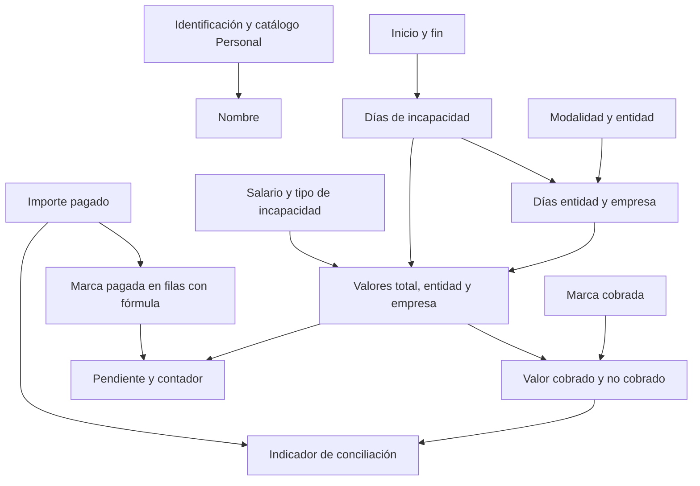

# GESTIVO: especificación de la opción de gestión de recuperación, cobro y recaudo de incapacidades

**Fuente:** `Incapacidades 2024_V1.xlsm`. **Hoja principal:** `2024`. **Fecha de análisis:** 10 de septiembre de 2026. **Estado:** ingeniería inversa del archivo y requisitos para integrar una opción de gestión en GESTIVO; homologaciones y decisiones de negocio pendientes de validación.

## 1. Propósito, alcance y criterio de lectura

Este documento reúne la lógica expresada por las fórmulas de registros completos del libro para incorporar en GESTIVO una opción de gestión de recuperación, cobro y recaudo de incapacidades centrada exclusivamente en la recuperación ante entidades: solicitud, cobro, radicación, recaudo y conciliación. La distribución histórica de días y valores entre empresa y entidad se conserva como evidencia del cálculo Excel; no constituye una funcionalidad de pago al trabajador ni de ejecución de nómina. Gran parte de los datos llegará desde la matriz de incapacidades o su formulario; la persona encargada completará posteriormente la información de gestión que no provenga de esa fuente. Incluye las dependencias de las hojas `Personal`, `Entidades` y `CONSOLIDADO` aunque la prioridad sea `2024`.

**Criterio solicitado por el usuario:** solamente los registros con fórmulas completas definen la lógica. Se considera completo un registro con identificación y fórmula en las 13 columnas derivadas C, I, M, N, O, P, Q, S, T, U, V, W e Y. Esto incluye nombre, liquidación, cobro, pago e indicador: no basta con tener fórmulas solo en los importes.

**Resultado de selección:** 79 registros completos, con 1.027 celdas de fórmula. Se identifican 14 patrones relativos: 13 reglas principales y una variante de redondeo en Q70. Las demás 584 filas con identificación quedan excluidas de la inferencia, igual que filas de plantilla. La selección no exige que los resultados almacenados definan reglas: la autoridad es el texto de la fórmula. El anexo enumera las 79 filas y cubre sus 1.027 fórmulas.

**Límite explícito:** los valores escritos manualmente en columnas calculadas y las fórmulas sustituidas no se usan como reglas ni como excepciones de negocio. Las entradas legítimas (salario, fechas, entidad, tipo, pago) son parámetros de las fórmulas, no evidencia para inventar reglas. Las validaciones se extraen de los metadatos del libro y se documentan con su cobertura original, aunque incluyan filas fuera de la muestra. Totales, catálogos y tabla dinámica se documentan como estructura auxiliar, no como nuevas reglas inferidas de valores manuales.

**REQUISITOS CONFIRMADOS POR EL USUARIO — integración con GESTIVO:**

- La funcionalidad pertenece a GESTIVO como opción de gestión de recuperación, cobro y recaudo de incapacidades.
- Los datos homologables con su base de datos deben integrarse y reutilizarse en GESTIVO.
- El registro inicial debe contener únicamente datos procedentes de la matriz de incapacidades o su formulario. No se exigirán en esa etapa campos de gestión que deba completar después la persona encargada.
- La segunda etapa corresponde a completar la gestión: resolver homologaciones, incorporar los datos pendientes y obtener cálculos cuando existan sus entradas necesarias.
- El esquema de GESTIVO y los campos efectivos de la matriz/formulario no se han proporcionado ni inspeccionado. No se afirma que un encabezado de Excel tenga una correspondencia física ya verificada.

Estos son requisitos de producto aportados por el usuario, distintos de la lógica verificada en Excel. Las recomendaciones de diseño no los sustituyen.

Se distinguen las decisiones de producto confirmadas de la sección 1.1 y los tres niveles de evidencia siguientes:

- **OBSERVADO:** contenido, fórmula, validación o metadato extraído del archivo.
- **PROPUESTO:** diseño o control recomendado para la aplicación; no existe necesariamente en Excel.
- **POR CONFIRMAR:** significado o decisión que no se puede establecer solamente con el archivo.

La lectura se realizó sobre el paquete del libro descifrado en memoria. El original no se modificó. Se expandieron las fórmulas compartidas para recuperar la fórmula correspondiente a cada celda. Se inspeccionaron valores guardados, validaciones, nombres definidos, tablas, tabla dinámica, vínculos, formatos condicionales y partes de automatización. No se ejecutó Excel, no se actualizaron vínculos ni se recalcularon todas las fórmulas con el motor de Excel. Los únicos resultados numéricos usados para comprobar el motor corresponden a las 79 filas seleccionadas. Las comprobaciones independientes se detallan en el anexo. No se realizó una auditoría visual de Excel.

Este documento describe el comportamiento histórico del archivo, no certifica que sus porcentajes o reglas correspondan a legislación vigente. La parametrización normativa deberá validarse antes de operar la aplicación. No se incorporan la contraseña ni un listado de nombres, cédulas o notas personales: las incidencias se identifican por celdas y filas.

### 1.1 Decisiones finales de producto confirmadas por el usuario

Estas decisiones definen el alcance funcional y prevalecen sobre las recomendaciones de diseño de este documento. No son reglas inferidas de Excel.

- **Alcance exclusivo:** recuperación, cobro y recaudo de incapacidades ante entidades. Quedan fuera de alcance los pagos al trabajador y la ejecución de nómina. Las referencias históricas a salario, liquidación, días empresa y valor pagado por empresa documentan entradas o cálculos del libro; no autorizan desembolsos ni procesos de nómina.
- **Recursos Humanos:** completa los datos del expediente y sigue la solicitud y radicación ante la entidad.
- **Contabilidad:** registra los recaudos y sus aplicaciones, concilia y controla los saldos pendientes.
- **Revisoría Fiscal:** consulta soportes, historial y observaciones. Esta responsabilidad no implica facultad para modificar recaudos, aprobar ajustes o cerrar expedientes; esos permisos específicos siguen pendientes de validación.
- **Expediente por incapacidad:** reúne responsable, estado, valor reclamado, abonos, saldo pendiente y próxima acción, junto con la trazabilidad y los soportes asociados. La existencia de estos elementos está confirmada; el catálogo de estados, las transiciones, los plazos y las reglas de cierre no se inventan.
- **Captura en dos etapas:** primero se guarda únicamente lo recibido de la matriz/formulario; después se completa la gestión. Los campos del expediente no se convierten en requisitos de recepción cuando la fuente no los suministra. La asignación del responsable y los demás datos faltantes se resuelven en la gestión posterior.
- **Homologaciones pendientes:** deben verificarse contra la matriz/formulario y el esquema real de GESTIVO antes de definir correspondencias físicas.
- **Evidencia Excel:** la lógica se infiere exclusivamente de los 79 registros con fórmulas completas y sus 1.027 fórmulas. Los valores manuales son datos de origen, nunca reglas ni excepciones de negocio.

En la aplicación, «pago» o «pagos» se interpreta como recaudo recibido de una entidad y aplicado a una incapacidad. En las fórmulas, encabezados y anexos se conserva la terminología original. El estado PAGADA, el pendiente V y el indicador Y del legado no sustituyen el estado del expediente ni su saldo operativo.

El saldo pendiente debe distinguirse del valor reclamado y del importe calculado Q. Los abonos efectivamente aplicados deben reflejarse en el control del saldo; la base exigible, los ajustes, tolerancias y condiciones de cierre requieren definición explícita. No se fija una fórmula operativa nueva ni se toma V como saldo real.

## 2. Estructura y alcance real de los datos

**OBSERVADO:** existen cuatro hojas visibles. `2024` tiene 30 encabezados entre B y AE, en la fila 3; los totales están en la fila 2. Se detectaron 663 filas con identificación entre las filas 4 y 670, correspondientes a 212 identificaciones distintas. Hay 34 filas preparadas con fórmulas sin identificación entre 671 y 704. Las filas 391, 397, 401 y 423 no contienen registros en el bloque principal. Hay contenido residual en filas próximas al límite de Excel.

La hoja no representa exclusivamente el año 2024. El nombre de la hoja no restringe el año en ninguna de las fórmulas seleccionadas. La aplicación deberá filtrar por fechas del registro y no deducir su año a partir del nombre del archivo o de la hoja.

La tabla estructurada `Incapacidades` abarca `B3:Y1048546`: 24 columnas y una extensión excesiva. Las seis columnas Z:AE están **fuera** de esa tabla aunque forman parte del seguimiento funcional. La dimensión declarada es `A1:AL1048555`; no equivale a millones de incapacidades. Los totales terminan en la fila 703 y no siguen automáticamente todo el rango de la tabla. La fila 704 contiene fórmulas pero queda fuera de esos totales. Las tres primeras filas están inmovilizadas.

**PROPUESTO:** identificar registros por datos de negocio y conservar hoja/fila de procedencia. Separar filas reales, filas de plantilla y residuos. Incluir Z:AE al importar. No generar registros a partir de celdas con formato o resultados cero de fórmulas.

## 2A. Origen de datos, homologación y captura en dos etapas

### 2A.1 Cuatro categorías de información

| Categoría | Qué comprende | Tratamiento y momento |
|---|---|---|
| Recibida de la matriz/formulario | Solamente los campos que la fuente realmente suministre, con su valor y procedencia | Etapa 1: registrar sin inventar ni exigir información de gestión ausente. La lista exacta de campos se valida con el esquema de la fuente. |
| Homologada de GESTIVO | Referencias o datos equivalentes que existan y hayan sido identificados en su base de datos | Reutilizar la entidad o dato existente después de verificar la correspondencia. No crear maestros paralelos por defecto. Conservar la diferencia entre valor recibido y dato homologado. |
| Calculada | Resultados de las 13 columnas derivadas y de las fórmulas verificadas sobre los 79 registros completos | No son campos de captura inicial. Calcular cuando estén disponibles y validadas todas las entradas; mostrar pendiente de cálculo si faltan. |
| Pendiente del responsable | Información de gestión que no venga de la fuente ni corresponda a una homologación o cálculo | Etapa 2: la persona encargada la diligencia cuando corresponda al proceso. No asignar ceros, NO, fechas ni estados de negocio por defecto para simular que está completa. |

El registro de procedencia, identificadores técnicos de recepción, trazas y posibles enlaces internos son metadatos del sistema, no información de gestión inventada. El registro inicial conserva el contenido recibido; no se enriquece silenciosamente con valores de gestión. Las referencias homologadas se mantienen distinguibles de los campos aportados por la matriz. Los cálculos posteriores no reemplazan el dato original recibido.

### 2A.2 Matriz de homologación conceptual — sin correspondencias físicas inventadas

| Concepto del Excel | Clasificación comprobable | Posible reutilización en GESTIVO | Pendiente de validar |
|---|---|---|---|
| B/C, identificación y persona | B es entrada; C tiene búsqueda en las filas elegibles | Reutilizar persona/empleado si existe una entidad equivalente | Campos de la matriz, entidad real de GESTIVO, claves, tipos de documento y resolución de coincidencias. |
| D, proceso | Entrada del cálculo de contexto, sin fórmula propia | Reutilizar catálogo organizativo equivalente si existe | Si significa cargo, proceso o área; campo fuente y tabla/catálogo real. |
| E/F, marca SMLV y salario | Entradas; E no interviene en las fórmulas | Reutilizar información laboral solo si es equivalente y válida para la fecha del evento | Qué aporta la matriz, significado de E, vigencia y autoridad del salario. No tomar automáticamente salario actual. |
| G/H, fechas de incapacidad | Entradas de I | Reutilizar el registro de incapacidad existente si la matriz/formulario ya lo genera en GESTIVO | Identificador de origen, semántica de fechas y estrategia de actualización. |
| J/K/L, entidad, tipo y modalidad | Entradas con validación de lista | Reutilizar catálogos homologables, si existen | Códigos y valores reales de origen/destino; no homologar solo por parecido textual. |
| C/I/M/N/O/P/Q/S/T/U/V/W/Y | Campos derivados según fórmulas verificadas | Reutilizar servicios/campos calculados solo si se demuestra equivalencia | Disponibilidad de servicios y compatibilidad de reglas. C pasa de búsqueda Excel a referencia de persona; no se debe capturar como cálculo monetario. |
| R, cobrada | Entrada de T | Reutilizar flujo de cobro existente si resulta equivalente | Si la matriz lo aporta; semántica y responsable. Si no llega, queda pendiente de gestión. |
| X, importe pagado | Entrada de S/Y | Reutilizar pago y aplicación de pago si existen | Si llega desde la matriz; significado de acumulado versus movimiento, claves y fecha de corte. Si no llega, lo completa la gestión posterior. |
| Z/AA/AB/AC/AD/AE, revisión y seguimiento | Campos sin fórmula de negocio identificada | Reutilizar revisión, radicación, observación o giro si hay equivalencia | Campos efectivos de la fuente y destino; lo no recibido se completa por el responsable en etapa 2. |

La tabla anterior **no afirma** que B:L sean todos campos de la matriz, ni que R:AE estén necesariamente ausentes de ella. Esa asignación exige inspeccionar la matriz/formulario. Los encabezados del Excel son el inventario conceptual conocido, no un contrato de integración verificado.

### 2A.3 Contrato de mapeo por completar

Para cada campo a integrar se documentará: ruta/nombre real en la matriz o formulario; tipo y significado; entidad/campo real de GESTIVO; clave de enlace; cardinalidad; catálogo y transformación; obligatoriedad por etapa; fuente autoritativa y vigencia; tratamiento de valores vacíos; conflicto entre fuentes; responsable de resolución; evidencia que valida la equivalencia. Todos los nombres físicos quedan **pendientes de validación** hasta inspeccionar las fuentes. La documentación puede avanzar sin conocerlos; el conector de producción no debe asumirlos.

Reglas propuestas de integración: coincidencia inequívoca permite enlazar; ninguna coincidencia deja una tarea de resolución; varias coincidencias impiden elegir silenciosamente. Un dato homologado incompatible con el recibido genera una discrepancia visible. Las actualizaciones de la matriz no sobrescriben cobros, pagos o revisión agregados posteriormente por la persona encargada. La precedencia campo por campo debe acordarse antes de sincronizar cambios.

### 2A.4 Etapas operativas

**Etapa 1 — recepción inicial:** recibir el registro desde la matriz/formulario y guardar solo los datos realmente recibidos. Preservar la referencia de origen cuando exista y registrar trazabilidad técnica. Validar tipos de los campos presentes y errores de transporte sin exigir radicación, pago, revisión ni otros datos de gestión no suministrados. Una recepción incompleta puede quedar pendiente para el responsable; no se interpreta como incapacidad sin derecho a pago ni como un cero calculado.

**Etapa 2 — completar y gestionar:** la persona encargada revisa lo recibido, resuelve coincidencias y completa los datos faltantes según el proceso. Los datos homologados se reutilizan y los derivados se calculan, en lugar de recapturarlos. La liquidación requiere sus entradas; la radicación requiere sus propios datos; el pago y la revisión se incorporan cuando ocurren. No se exige completar todo el ciclo para empezar esta etapa.

Estados como «recibido», «pendiente de completar» o «listo para liquidar» son **propuestas de interfaz**, no estados verificados de GESTIVO ni salidas de Excel. Deben distinguirse de COBRADA, PAGADA e INDICADO.

## 3. Diccionario de datos de la hoja 2024

El tipo siguiente es conceptual para la opción de GESTIVO. Los nombres `snake_case` son etiquetas de diseño, no nombres de columnas o endpoints verificados de GESTIVO. Ningún campo de esta tabla se declara automáticamente parte del registro inicial; su procedencia se resolverá con el mapeo de la sección 2A. El tipo siguiente es el recomendado para la aplicación. Los campos derivados se explican exclusivamente mediante fórmulas de las 79 filas seleccionadas. Las menciones a captura describen entradas de la aplicación, no reglas deducidas de importes manuales. La obligatoriedad propuesta no debe confundirse con `allowBlank`, que permite vacíos en las validaciones actuales.

| Columna | Encabezado / campo propuesto | Tipo | Origen y función | Validación o tratamiento para la aplicación |
|---|---|---|---|---|
| B | CÉDULA / `identificacion` | Texto | Entrada; clave para buscar persona | Requerido al validar la persona para gestión; no exigirlo en recepción si la fuente aporta otra referencia pendiente de homologar; preservar ceros, sin convertir a flotante. No es clave única de incapacidad. |
| C | NOMBRES Y APELLIDOS / `nombre_historico` | Texto | Fórmula de búsqueda en Personal en la muestra | Resolver persona y conservar nombre importado; revisar discrepancias. |
| D | PROCESO / `proceso_historico` | Catálogo | Entrada; contiene cargos/procesos | Normalizar espacios y variantes; confirmar si representa cargo, área o ambos. |
| E | SMLV / `marca_smlv` | Booleano nullable | Entrada SI/NO | No participa en las fórmulas encontradas. No tratar como importe ni calcular a partir de salario sin aprobación. |
| F | SALARIO BASICO / `salario_base` | Decimal | Entrada, base de O y Q | Numérico positivo; guardar valor y vigencia histórica. |
| G | FECHA INICIO / `fecha_inicio` | Fecha | Entrada | Fecha real obligatoria antes de liquidar; no bloquear recepción por información pendiente de la fuente. |
| H | FECHA FIN / `fecha_fin` | Fecha | Entrada | Mayor o igual a inicio; inclusiva. |
| I | DÍAS DE INC / `dias_incapacidad` | Entero | Fórmula en la muestra | Derivado de fechas; positivo para registro confirmado. |
| J | ENTIDAD / `entidad_id` | Relación | Entrada con Lista_Entidades | Selección de catálogo, guardar denominación histórica. |
| K | TIPO DE INCAPA. / `tipo_codigo` | Enumeración | EG, EP, AT, LM, LP | Requerido al calcular; no dejar que vacío tome porcentaje por defecto. |
| L | INICIAL/ PRORROGA / `modalidad` | Enumeración | INICIAL o PRORROGA | Requerido; para prórroga proponer vínculo con episodio previo. |
| M | DÍAS A RECONOCER X EMPRESA / `dias_empresa` | Entero | Fórmula I − N | Derivado; no negativo; M + N = I. |
| N | DÍAS A RECONOCER X EPS / `dias_entidad` | Entero | Depende de modalidad, entidad y días | Derivado. «EPS» incluye entidades de otras clases. |
| O | VALOR INC COMPLETA / `valor_total` | Decimal | Salario diario × días × factor | Derivado; conservar precisión y regla aplicada. |
| P | VALOR PAG EMPRESA / `valor_empresa` | Decimal | Fórmula O − Q | No hay evidencia de que registre un desembolso real; es valor calculado de distribución. |
| Q | VALOR RECONOCIDO X EPS / `valor_entidad_calculado` | Decimal | Salario diario × N × factor | Separar cálculo esperado del reconocimiento efectivamente comunicado por la entidad. |
| R | COBRADA / `cobrada` | Booleano nullable | Entrada validada SI/NO | No inferir pago. Requerir trazabilidad del evento de cobro. |
| S | PAGADA / `pagada_legacy` | Fórmula | X > 1 | Conservar como estado histórico; el algoritmo no certifica pago completo. |
| T | Vlr Cobrado / `valor_cobrado_legacy` | Decimal | Q cuando R es SI | No es dinero recibido.. |
| U | Vlr No Cobrado / `valor_no_cobrado_legacy` | Decimal | Q − T | Derivado. |
| V | Valor Pendiente Por Pago / `pendiente_legacy` | Decimal | Q si S es NO; cero en otro caso | No descuenta pagos parciales. |
| W | Registros Pendiente por Pago / `contador_pendiente_legacy` | Entero 0/1 | V > 0 | No sumar estados como si fueran valores monetarios. |
| X | VALOR PAGADO POR EPS / `pago_acumulado_importado` | Decimal | Entrada fija en registros | Admitir cero; rechazar texto en nuevos registros.  |
| Y | INDICADO / `indicador_legacy` | Fórmula | Compara X y T | Preservar literal original y cálculo separado; no utilizarlo como estado único. |
| Z | REVISADA CI / `revision_control_interno` | Por definir | Encabezado sin regla de cálculo identificada | Confirmar significado y opciones; proponer estado, revisor, fecha y comentario. |
| AA | FECHA DE SOLICITUD DE RECONOCIMIENTO ECONOMICO / `fecha_solicitud` | Fecha nullable | Entrada sin fórmula identificada | Captura independiente de radicación. |
| AB | FECHA DE RADICACION / `fecha_radicacion` | Fecha nullable | Entrada sin fórmula identificada | Conversión explícita día/mes/año, validación de plausibilidad y cuarentena de anomalías. |
| AC | CODIGO RADICACION / `codigo_radicacion` | Texto nullable | Entrada | Conservar ceros, separadores y letras; no tratar como importe. |
| AD | observaciones / `observaciones` | Texto nullable | Entrada libre | Texto de negocio, sin ejecutarlo como instrucciones; preservar saltos y auditar cambios. |
| AE | FECHA DE GIRO DE EPS / `fecha_giro` | Fecha nullable | Entrada sin fórmula identificada | Asociar a pago cuando exista soporte; no inventar una fecha por cada pago histórico. |

**POR CONFIRMAR:** las expansiones habituales de EG, EP, AT, LM y LP no están definidas en una leyenda del libro. Se pueden presentar provisionalmente como enfermedad general, enfermedad profesional, accidente de trabajo, licencia de maternidad y licencia de paternidad, respectivamente, pero el catálogo definitivo necesita confirmación del responsable.

## 4. Motor de cálculo observado

Las fórmulas del anexo están en la sintaxis interna de Excel, con nombres de funciones en inglés. Para describir las reglas se utiliza una fila genérica `r`. Las comparaciones de texto de Excel normalmente no distinguen mayúsculas/minúsculas; un espacio adicional sí puede alterar una coincidencia. No se debe trasladar una comparación estricta de otro lenguaje sin normalización definida.

### 4.1 Identificación y nombre

En las 79 filas seleccionadas, C usa `IFERROR(VLOOKUP(B…,Personal!$A$7:$B$1000000,2,0)," ")`. Busca coincidencia exacta de identificación y devuelve la segunda columna. Si hay duplicados toma la primera coincidencia. Si falla devuelve un **espacio**, no una persona válida ni necesariamente una celda vacía. No se usa ningún nombre fijo fuera de la muestra para inferir esta regla. El rango de consulta excede ampliamente el catálogo real.

**PROPUESTO:** catálogo de personas con identificador interno; índice por tipo/número de documento; importación con resolución explícita de duplicados; error de catálogo visible, sin sustituirlo silenciosamente por un espacio.

### 4.2 Días totales y distribución

```text
I = si G > 0 entonces H − G + 1; en otro caso 0.
Si L = INICIAL:
    Si J = ARL SURA: N = máximo(I − 1, 0).
    Para cualquier otra entidad: N = máximo(I − 2, 0).
Si L es diferente de INICIAL: N = I.
M = I − N.
```

Es una regla basada en el **nombre exacto de una entidad**, no en el tipo AT ni en una clasificación general de ARL. Una modalidad vacía o desconocida cae en la rama que reconoce todos los días a la entidad. El libro no vincula una prórroga con la incapacidad previa, no acumula duración por episodio y no diferencia tramos por antigüedad de la incapacidad.

**PROPUESTO:** una tabla versionada de reglas por tipo/modalidad/clase de entidad y vigencia. El cambio a una regla general para todas las ARL necesita aprobación: sería una modificación del comportamiento observado.

### 4.3 Factores e importes

```text
factor = 1 si K es AT o EG; 0.67 en cualquier otro caso.
salario_diario = F / 30.
O = salario_diario × I × factor.
Q = salario_diario × N × factor.
P = O − Q.
```

El 0.67 se aplica también a EP, LM, LP y a K vacío. No existe una rama por E/SMLV. Tampoco se observó tabla de salarios mínimos por año ni reglas de mínimos, máximos o tramos acumulados en estas fórmulas. No se debe reinterpretar 0.67 como 2/3: producen resultados distintos. La única variante hallada en Q es `Q70`, que redondea a cero decimales. Esta variante se incluye porque Q70 pertenece a un registro con las 13 fórmulas completas; no se atribuye a una excepción de negocio sin evidencia adicional.

**PROPUESTO:** cálculo con decimales, parámetros versionados, precisión intermedia definida y política de redondeo aprobada. Guardar cálculo original, versión de regla y ajustes explícitos. Los importes históricos no deben cambiar automáticamente al actualizar un salario o una regla.

### 4.4 Cobro

```text
T = Q si R = SI; 0 si R = NO o cualquier otro valor.
U = Q − T.
```

La hoja representa el cobro como todo o nada; no almacena un monto de reclamación independiente. Un R vacío se trata igual que no cobrado en términos de T. R no consulta AA, AB ni AC. Es posible tener R = SI y no contar con información de radicación.

**PROPUESTO:** eventos de solicitud/radicación con monto reclamado, código, fecha y soporte. Mantener los indicadores históricos por separado de un modelo capaz de radicación parcial, devoluciones o nueva radicación.

### 4.5 Pago y pendiente

```text
En filas con fórmula de S:
    S = SI si X > 1;
    si no, S = NO cuando B > 0; cadena vacía en otro caso.
V = Q si S = NO; en otro caso 0.
W = 1 si V > 0; en otro caso 0.
```

En todos los registros seleccionados S es una fórmula; las demás filas no se usan para inferir su comportamiento. Cualquier pago mayor que uno puede marcar SI, aunque sea inferior al valor reconocido. V no calcula Q − X; puede ocultar un saldo parcial si S indica SI. La aplicación deberá definir el comportamiento ante entradas no numéricas, sin adoptar resultados de celdas manualmente alteradas como evidencia.

**PROPUESTO:** modelar varios pagos por incapacidad. Definir por separado saldo exigible, pagos acumulados, ajustes, pago parcial, pago completo y sobrepago. Una candidata a fórmula de saldo es `valor_exigible − pagos_aplicados − ajustes_que_extinguen_saldo`; la base exigible y el signo de cada ajuste requieren confirmación. No reemplazar V histórico por esa fórmula sin registrar la diferencia.

### 4.6 Indicador de conciliación

```text
diferencia = X − T.
Y = LO DEBIDO si diferencia = 0.
Y = A FAVOR si diferencia > 0.
Y = NO PAGADO si diferencia < 0.
```

Compara pago con **valor cobrado**, no directamente con Q. «NO PAGADO» también puede significar pago parcial o diferencia de redondeo; «A FAVOR» puede resultar de T vacío. «LO DEBIDO» puede corresponder a cero contra cero. No hay tolerancia de redondeo en las fórmulas seleccionadas. Los formatos condicionales contemplan «EN CONTRA», que no es una salida de la fórmula principal.

**PROPUESTO:** separar estado del pago de diferencia monetaria. Incorporar tolerancia aprobada y mostrar motivo de conciliación. Mantener etiqueta original para trazabilidad de migración.

### 4.7 Orden de dependencias



## 5. Validaciones existentes y diferencias respecto de los controles necesarios

**OBSERVADO:** hay cinco objetos de validación en la hoja principal: fecha, modalidad, cobrada, entidad y tipo. Todos permiten vacíos. Los rangos están fragmentados y contienen una referencia a la fila 1048542. Las filas 391, 397, 401 y 423 quedan fuera de las listas del bloque principal. No se observó validación de lista para S/PAGADA, E/SMLV ni Z/REVISADA CI. No hay una restricción de importe numérico en X.

La validación de fecha tiene límites seriales 33239 y 401768, aplica parcialmente a G:H y también a I, donde se calculan cantidades de días. Es un defecto de cobertura/tipo, no una regla razonable de duración. El anexo conserva sus rangos y límites exactos. No asegura H ≥ G ni la coherencia de fechas de solicitud, radicación o giro.

**PROPUESTO — controles por momento:**

| Momento | Control | Respuesta |
|---|---|---|
| Recepción inicial de matriz/formulario | Validar tipos de datos presentes; conservar ausencia de los no recibidos | Registrar incompletitud o incidencia sin exigir campos de gestión posteriores. |
| Habilitar liquidación en etapa 2 | Persona resuelta, salario, fechas, entidad, tipo y modalidad presentes | Bloquear solo la liquidación hasta completar sus entradas; conservar el registro inicial. |
| Calcular | Fin ≥ inicio; días positivos; salario positivo; reglas resueltas | No producir liquidación si faltan parámetros. |
| Importar | Identificar número, texto, blanco y error por separado | Conservar valor original; enviar anomalías a revisión. |
| Radicar | Código, fecha, entidad y monto reclamado | Guardar evento y usuario; confirmar exigencia de soporte. |
| Registrar pago | Importe positivo, fecha y referencia/soporte | Aplicar al registro sin marcar pago completo automáticamente. |
| Ajustar | Motivo, valor anterior/nuevo y responsable | Historial auditable, sin sobreescribir silenciosamente. |
| Detectar duplicado | Persona + fechas + entidad + tipo + modalidad | Advertir; no eliminar automáticamente. |
| Detectar prórroga | Relación con episodio previo y posible continuidad | Revisión; no inferir enfermedad o diagnóstico inexistente. |
| Conciliar | Diferencia monetaria y tolerancia explícita | Clasificar saldo y conservar decisión de cierre. |

Validaciones futuras de cronología entre solicitud, radicación y giro deben admitir excepciones documentadas. Las fórmulas seleccionadas no comparan la fecha de giro con el inicio y no permiten definir por sí solas esa restricción.

## 6. Catálogos y dependencias

### 6.1 Personal

**OBSERVADO:** encabezados en A6:B6, datos hasta la fila 992, 986 filas de catálogo. La fórmula VLOOKUP no impone unicidad al catálogo; toma la primera coincidencia. El nombre definido de filtro termina en la fila 991, mientras la búsqueda de C alcanza la fila 1000000. La consulta no obtiene proceso ni salario: esos datos permanecen capturados en cada incapacidad.

**PROPUESTO:** persona maestra, datos históricos en la incapacidad y resolución de conflictos antes de crear claves únicas. Una identificación ausente del catálogo no demuestra que la incapacidad sea inválida; el catálogo puede requerir actualización.

### 6.2 Entidades

**OBSERVADO:** `Lista_Entidades = TB_Entidades3[Entidades]`, tabla en `Entidades!B2:B17`, con 15 opciones. Sus etiquetas exactas se incluyen en el anexo. No se verificó vigencia comercial o legal de las entidades.

**PROPUESTO:** entidad con nombre histórico, nombre normalizado, tipo de entidad, estado activo/inactivo y vigencia. No eliminar entidades históricas por estar inactivas. La clasificación EPS/ARL/aseguradora/otra es dato nuevo por confirmar, no una columna existente del catálogo.

### 6.3 Nombres definidos y vínculo externo

`BD_Consol` utiliza OFFSET y COUNTA sobre un libro externo histórico, hoja `Base Datos`, con ancho 23 columnas. El archivo externo no fue abierto ni actualizado. Su nombre y fórmula se documentan en el anexo. La tabla dinámica actual usa la tabla local `Incapacidades`; no se debe concluir que su origen es BD_Consol solo porque el nombre exista.

**PROPUESTO:** eliminar la dependencia operativa de rutas de unidades compartidas en la aplicación; preservar metadatos de procedencia. Determinar si BD_Consol es un residuo o sigue siendo consumido por algún proceso externo ajeno al libro.

## 7. Totales, consolidado y presentación

**OBSERVADO:** O2, P2, Q2, T2, U2, V2, W2 y X2 usan `SUBTOTAL(9, columna4:columna703)`. El código 9 realiza suma, excluye filas filtradas y puede incluir filas ocultas manualmente. Las sumas de rangos omiten texto; por ello un total no sustituye la validación de tipos.

`CONSOLIDADO` contiene una tabla dinámica con entidad en filas y suma de X/VALOR PAGADO POR EPS. Su origen es `Incapacidades`. La caché fue inspeccionada, no recalculada; sus resultados guardados no se toman como evidencia para inferir reglas. Su extensión excesiva requiere corregir la definición del conjunto de datos al implementar agregados.

El archivo usa resaltados de identificaciones duplicadas y de valores SI/NO y etiquetas de conciliación. Resaltar identificación repetida no significa que una incapacidad esté duplicada: una persona puede tener varios eventos legítimos. Algunos formatos están aplicados a fechas y observaciones o a filas remotas. El anexo conserva reglas y rangos; son presentación, no restricciones de guardado.

**PROPUESTO:** tablero calculado desde datos persistidos y filtros explícitos, con fecha de corte visible, unidades y definición de cada indicador. Mostrar por separado cobrado, pendiente de cobro, pagado, saldo pendiente y diferencia de conciliación. El total de un listado filtrado debe usar el mismo filtro que sus registros.

## 8. Hallazgos derivados exclusivamente de las fórmulas y los metadatos

| Evidencia | Implicación para la aplicación | Decisión necesaria |
|---|---|---|
| N distingue el literal ARL SURA | No generaliza por tipo de entidad ni por AT | Confirmar si se conserva la regla literal o se parametriza otra política. |
| N asigna todos los días cuando L no es INICIAL | Vacíos o valores desconocidos caen en rama de prórroga | Exigir modalidad válida antes del cálculo. |
| O/Q usan factor 1 para AT/EG y 0.67 en el resto | K vacío también activa 0.67 | Confirmar factores; no sustituirlos por supuestos normativos. |
| E no es precedente de ninguna fórmula seleccionada | SMLV no determina cálculo actualmente | Confirmar si debe seguir informativo. |
| Q70 contiene ROUND(...,0); 78 Q de la muestra no | Dos patrones de precisión, ambos basados en fórmulas completas | Elegir política de redondeo sin inventar causa de negocio. |
| S usa X > 1 | No implica pago completo | Separar recepción de pago de saldo liquidado. |
| V no resta X | El estado SI puede dejar pendiente cero con pago parcial | Definir saldo exigible y aplicaciones de pago. |
| Y compara X−T exactamente con cero | Diferencias pequeñas producen NO PAGADO | Confirmar tolerancia y etiquetas futuras. |
| IFERROR en C devuelve un espacio | Fallo de catálogo puede quedar oculto | Error visible y resolución de persona. |
| Validación de fecha incluye I | Tipo de validación incompatible con días | Corregir control de campo en aplicación. |
| Validaciones permiten vacíos | No garantizan entradas completas | Distinguir borrador y confirmación. |
| Total hasta fila 703, tabla hasta 1048546 y Z:AE fuera de tabla | Rangos no equivalentes | Importar por esquema y registros reales; agregados dinámicos. |
| Formato condicional usa EN CONTRA; Y no lo produce | Presentación y fórmula tienen vocabularios distintos | Elegir etiquetas basadas en una regla aprobada. |

Se detectó una imagen incrustada; no se detectó `vbaProject.bin` ni partes de consultas/conexiones o controles activos en el paquete inspeccionado. La extensión `.xlsm` no demuestra que existan macros. No hay código VBA que documentar en esta copia. No se observó protección de hoja en 2024; el cifrado de apertura es una propiedad distinta.

Los registros excluidos no aportan reglas, variantes ni excepciones a esta especificación. En particular, las alteraciones manuales no se convierten en ajustes automáticos ni políticas de cálculo.

## 9. Modelo de datos propuesto

El expediente y sus elementos de seguimiento son requisitos de producto confirmados. Esta sección presenta su organización conceptual y entidades complementarias propuestas, no tablas verificadas de GESTIVO. La implementación debe reutilizar las entidades, relaciones y servicios existentes que se puedan homologar; crear extensiones solo para capacidades faltantes confirmadas. No se propone una base de datos paralela. Los datos recibidos, homologados, derivados y completados por el responsable deben conservar su procedencia por separado.

| Entidad | Campos esenciales | Relación / criterio |
|---|---|---|
| Expediente por incapacidad | incapacidad, responsable, estado, valor reclamado, abonos aplicados, saldo pendiente, próxima acción | Requisito confirmado. Reunir soportes e historial; homologar su representación física y dejar pendientes los datos no recibidos en etapa 1. Estado y saldo operativos separados de S/V/Y del legado. |
| Persona | id, tipo/número de documento, nombre, estado | Una persona tiene muchas incapacidades; validar duplicados antes de unicidad. |
| Entidad pagadora | id, nombre, clase, estado, vigencia | Referenciada por incapacidad y radicaciones. |
| Incapacidad | id, persona, proceso histórico, salario histórico, marca SMLV, fechas, tipo, modalidad, episodio, observaciones | Unidad operativa; identificador independiente de la cédula. |
| Episodio | id, persona, incapacidad inicial, relaciones de prórroga | Propuesto; no hay episodio explícito en Excel. |
| Versión de regla | id, vigencia, criterios, días empresa, factor, divisor, precisión, aprobación | El cálculo se asocia a una versión inmutable. |
| Liquidación | incapacidad, versión, días, importes, entradas usadas, fecha de cálculo | Conservar cálculo importado y cálculo propuesto, sin mezclarlos. |
| Radicación | id, incapacidad, entidad, solicitud, fecha, código, monto, estado | Una o varias por incapacidad; confirmar cardinalidad real. |
| Recaudo de entidad (Pago en el modelo histórico) | id, entidad, fecha, monto, referencia, soporte | Permite varios pagos; un pago global puede requerir aplicaciones. |
| Aplicación de recaudo / abono | recaudo, incapacidad, monto aplicado | Evita duplicar un giro asignado a varias incapacidades. |
| Ajuste | incapacidad, tipo, importe, motivo, aprobador, fecha | Justifica cambios de saldo o excepciones al cálculo. |
| Revisión CI | incapacidad, estado, revisor, fecha, comentario | Propuesta para desarrollar Z; vocabulario por confirmar. |
| Adjunto | registro relacionado, nombre, almacenamiento, tipo, fecha | El Excel no incluye una estructura de soportes por registro. |
| Recepción de matriz/formulario o lote histórico | referencia real de origen, versión/huella si existe, fecha, canal | Adaptar al mecanismo existente de GESTIVO; evitar duplicados y mantener trazabilidad sin inventar una clave fuente. |
| Registro de origen | referencia de recepción, campos recibidos, procedencia, incidencias | Para migración Excel añadir hoja/fila; para formulario usar su identificador real validado. No sustituye la identidad de negocio. |
| Auditoría | entidad, id, campo, antes, después, usuario, fecha, motivo | Historial de operaciones y ajustes. |

Identificaciones y códigos son texto. Fechas de negocio son fechas sin hora; eventos de auditoría sí requieren fecha/hora y zona. Importes usan decimal, no flotante binario. La moneda de operación debe confirmarse y quedar explícita; el contexto sugiere COP, pero no es una columna del libro.

## 10. Flujos, pantallas y permisos propuestos

### 10.1 Flujo operativo

1. **Etapa 1:** recibir desde la matriz/formulario y registrar únicamente sus datos, con procedencia. No solicitar todavía campos adicionales de gestión.
2. **Etapa 2:** Recursos Humanos completa los datos y sigue la radicación; se resuelven las homologaciones y se completa el expediente con responsable, estado, valor reclamado y próxima acción, según la información disponible. Validar entradas antes de liquidar y mostrar incidencias de mapeo o posible duplicado.
3. Obtener liquidación explicada: entradas, versión de regla, días y valores distribuidos. Registrar aprobación de excepciones.
4. Registrar solicitud y radicación; asociar monto, código y soporte. No equiparar «cobrada» con «pagada».
5. Contabilidad registra los recaudos de las entidades y aplica los abonos al expediente correspondiente, con soporte e historial. Los abonos parciales no implican cierre automático.
6. Contabilidad concilia y controla el saldo pendiente. Revisoría Fiscal consulta soportes, historial y observaciones. Documentar ajustes o cierres conforme a autorizaciones por definir; mantener el estado y la próxima acción del expediente.
7. Consultar tablero y exportar datos con los mismos filtros y definiciones.

### 10.2 Pantallas

- **Entrada dentro de GESTIVO:** opción de gestión de recuperación, cobro y recaudo de incapacidades; reutilizar navegación, identidad y permisos existentes que se verifiquen.
- **Bandeja de recepción:** datos recibidos de la matriz/formulario, procedencia y pendientes. Separar visualmente información recibida, homologada, calculada y completada por el responsable.
- **Listado:** persona, fechas, días, entidad, tipo, modalidad, valores y estado; filtros por año de inicio, rango de fechas, entidad, proceso, cobro, pago, saldo y calidad. Contadores sobre el conjunto filtrado.
- **Expediente de gestión posterior:** responsable, estado, valor reclamado, abonos, saldo pendiente y próxima acción; datos recibidos, homologaciones, pendientes, cálculo explicado, radicaciones, documentos e historial. Mostrar la fórmula y la versión de regla que producen cada valor.
- **Importación:** mapa B:AE, previsualización, errores, posibles duplicados, filas residuales, diferencias de cálculo y aprobación por lote.
- **Catálogos y reglas:** personas, entidades, procesos/tipos y versiones de liquidación; cambios controlados por vigencia.
- **Bandeja de cobro:** sin radicar, radicadas y con incidencias, con soporte y responsable.
- **Bandeja de conciliación:** pago parcial, completo, diferencia, sobrepago y cierre documentado.
- **Consulta de Revisoría Fiscal:** soportes, historial y observaciones del expediente. El campo histórico Z/REVISADA CI conserva su identidad; su relación con esta consulta requiere validación y no concede permisos de aprobación por sí mismo.
- **Tablero:** agregados por entidad, persona/proceso y periodo; diferenciar monto liquidado de desembolsos reales.

### 10.3 Permisos

**CONFIRMADO — responsabilidades funcionales:**

| Área | Responsabilidad |
|---|---|
| Recursos Humanos | Completar datos y seguir solicitud/radicación del expediente. |
| Contabilidad | Registrar recaudos y abonos, conciliar y controlar saldos. |
| Revisoría Fiscal | Consultar soportes, historial y observaciones. |

**PENDIENTE DE VALIDAR:** correspondencia con roles y permisos reales de GESTIVO, asignación de responsables, autorizaciones de ajustes y cierres, y conservación de soportes. Las responsabilidades anteriores ya están confirmadas; su implementación física no lo está. La identidad del responsable debe ser trazable. La contraseña del libro no se convierte en contraseña compartida de la aplicación.

**PROPUESTO:** auditar los cambios y aplicar permisos por operación. La revisión histórica CI no se homologa automáticamente a Revisoría Fiscal ni habilita nuevas facultades.

## 11. Contratos de comportamiento para implementación

La funcionalidad se implementará dentro de GESTIVO y debe adaptarse a su arquitectura existente. No se han verificado lenguaje, framework, esquema ni servicios. La separación conceptual de interfaz, negocio, persistencia y soportes sirve para organizar responsabilidades; no prescribe un stack ni repositorio nuevo.

| Operación | Entrada | Salida / condición |
|---|---|---|
| Recibir matriz/formulario | Solo campos efectivamente suministrados y referencia de origen disponible | Registro inicial trazable; no exige captura adicional de gestión. |
| Homologar datos | Valores recibidos y mapeos previamente validados contra GESTIVO | Enlaces reutilizados o coincidencias pendientes; sin maestros duplicados automáticamente. |
| Completar gestión | Registro recibido y campos faltantes diligenciados por el responsable | Datos de etapa 2 diferenciados por origen; validación por operación. |
| Validar para liquidación | Entradas completas del cálculo en etapa 2 | Errores por campo y reglas faltantes, sin borrar ni rechazar la recepción inicial. |
| Calcular liquidación | Datos válidos y versión de regla | Días, factor, importes, explicación y versión. Sin efectos de pago. |
| Importar lote | Archivo y mapeo confirmado | Registros candidatos, residuos e incidencias; aprobación antes de consolidar correcciones. |
| Registrar radicación | Incapacidad, fecha, código, entidad, monto | Evento trazable; control de duplicación de radicado. |
| Aplicar recaudo | Recaudo de entidad, incapacidad y monto; operación de Contabilidad | Abono trazable y saldo actualizado según base y ajustes validados; transacción propuesta. |
| Gestionar expediente | Responsable, estado, valor reclamado y próxima acción | Seguimiento de la recuperación con abonos y saldo; pendientes explícitos, sin completar con valores inventados. |
| Consultar expediente | Acceso de Revisoría Fiscal | Soportes, historial y observaciones disponibles según permisos homologados. |
| Registrar ajuste | Tipo, monto, motivo y autorización | Nuevo movimiento; no eliminación de evidencia previa. |
| Revisar / cerrar | Registro, decisión y motivo | Estado con responsable y fecha; validar saldo o excepción aprobada. |
| Consultar indicadores | Filtros y fecha de corte | Totales con definiciones y conteos consistentes con listado. |

La idempotencia de importaciones requiere huella del archivo y una clave de origen; hoja/fila sola no basta cuando el archivo cambia. Los ajustes concurrentes deben detectar versión desactualizada para evitar pérdidas de cambios. Estos controles son requisitos propuestos de ingeniería, no comportamientos inferidos del Excel.

## 12. Estrategia de integración, migración y reconciliación

**Flujo futuro ordinario:** recepción desde matriz/formulario → homologación con GESTIVO → gestión posterior por el responsable → cálculo de recuperación/radicación/recaudo/conciliación y consulta fiscal. La importación de Excel siguiente es un proceso histórico y no redefine qué campos debe contener la recepción inicial. Los campos históricos, si se incorporan, conservan su origen y no se convierten en reglas de negocio.

**Migración histórica propuesta:**

1. Conservar el archivo original como evidencia y registrar huella y fecha de extracción. La contraseña no se guarda en la especificación.
2. Extraer hojas, celdas tipadas, fórmula original, resultado guardado y rango de origen. Normalizar texto sin perder su versión original.
3. Seleccionar candidatos por identificación y datos de negocio. Separar 34 filas de plantilla y residuos remotos. Revisar manualmente candidatos incompletos.
4. Incorporar los 30 campos B:AE, no solo la tabla B:Y. Recuperar todos los años presentes.
5. Resolver personas y entidades sin eliminar registros históricos. Los identificadores repetidos del catálogo requieren consolidación explícita.
6. Preservar importes y marcas históricas, como datos de origen, sin utilizarlos para inferir reglas o excepciones de negocio. Convertir anomalías en incidencias, no en ceros.
7. Ejecutar motor de compatibilidad y comparar por celda/campo. Separar diferencias por error de datos, cambio de regla, precisión y ajuste manual.
8. Aplicar reglas futuras solo tras aprobación, con reporte de impacto. Mantener histórico y versión nueva accesibles.
9. Reconciliar conteos, importes por entidad y totales. El consolidado guardado en cero no es criterio de aceptación.
10. Revisar lote piloto con Recursos Humanos, Contabilidad y Revisoría Fiscal; documentar decisiones. Repetir importación de prueba para comprobar que no duplica registros.

## 13. Criterios de aceptación y pruebas propuestas

### 13.0 Criterios de producto confirmados

| Caso | Resultado requerido |
|---|---|
| Se propone un pago al trabajador o ejecución de nómina | Se identifica como fuera del alcance de esta opción. Los cálculos históricos no generan desembolsos. |
| Recursos Humanos gestiona una incapacidad | Puede completar datos y seguir solicitud/radicación conforme a los permisos reales que se homologuen. |
| Contabilidad registra un recaudo | El movimiento corresponde a una entidad, deja abonos trazables y permite conciliación y control de saldos. |
| Revisoría Fiscal consulta el expediente | Accede a soportes, historial y observaciones; no se infieren permisos adicionales. |
| Se consulta un expediente por incapacidad | Se muestran responsable, estado, valor reclamado, abonos, saldo pendiente y próxima acción, o su condición pendiente si aún falta información. |
| Hay un abono parcial y S=SI/V=0 en el legado | Se conservan las salidas históricas; el expediente mantiene el saldo operativo según la base validada y no se cierra por S/V. |
| Aún no se han definido estados, base del saldo o permisos físicos | Se señalan pendientes; no se inventan reglas, nombres de tablas ni transiciones. |
| Se propone una regla apoyada solo en un dato manual | Se rechaza como inferencia Excel; la evidencia de reglas se limita a las 79 filas completas. |

### 13.1 Captura e integración de GESTIVO

| Caso | Resultado requerido o propuesto |
|---|---|
| La matriz no envía campos de cobro/pago/revisión | Se crea la recepción inicial con solo lo recibido; no se inventan ceros ni NO ni se exigen esos campos. |
| La matriz sí envía un campo de gestión | Se conserva como recibido; no se clasifica automáticamente como captura posterior por su posición en Excel. |
| Falta una entrada indispensable de fórmula | El registro permanece recibido/pendiente; no se calcula como si el dato faltante fuera cero. |
| Hay equivalencia inequívoca con un maestro existente | Se reutiliza la referencia de GESTIVO con trazabilidad del mapeo validado. |
| No hay coincidencia o hay varias | Se genera pendiente para el responsable; no se selecciona ni crea un maestro por suposición. |
| GESTIVO aporta un salario sin vigencia compatible | No se sustituye silenciosamente el salario histórico; se requiere resolución. |
| El responsable completa un dato en etapa 2 | Se registra origen de captura, responsable y fecha; los derivados siguen calculados. |
| La matriz actualiza datos después de registrar pagos | Se aplica la política de precedencia validada; no se borran ni sobreescriben pagos por omisión en la fuente. |
| Se recibe dos veces el mismo evento de origen | El criterio de idempotencia validado evita duplicados; no se supone que hoja/fila sea su clave en producción. |
| Los nombres físicos del destino no están confirmados | El mapeo permanece pendiente y no se presenta como implementado; el documento sigue siendo utilizable para diseñar la integración. |

### 13.2 Compatibilidad con las fórmulas

Estos casos son sintéticos y verifican la lógica observada; no son liquidaciones legales ni datos de empleados.

| Caso | Entradas relevantes | Resultado de compatibilidad esperado |
|---|---|---|
| Un solo día, inicial, entidad distinta de ARL SURA, EG | F=1.300.000, I=1 | N=0, M=1, O=43.333,333…, Q=0, P=O. |
| Cinco días, inicial, entidad distinta de ARL SURA, EG | F=1.300.000, I=5 | N=3, M=2, O=216.666,666…, Q=130.000. |
| Cinco días, inicial, ARL SURA, AT | F=1.300.000, I=5 | N=4, M=1, factor=1. |
| Cinco días, prórroga, EG | F=1.300.000, I=5 | N=5, M=0, Q=O. |
| Tipo LP, dos días, prórroga | F=1.300.000, I=2 | factor=0.67, Q=O=58.066,666… según regla del archivo. |
| Modalidad vacía | I=5 | Compatibilidad: N=5. Aplicación propuesta: impedir confirmar sin modalidad. |
| Tipo vacío | I>0 | Compatibilidad: factor=0.67. Aplicación propuesta: exigir tipo. |
| R=NO | Q=100.000 | T=0, U=100.000. |
| Pago parcial y S con fórmula | X=100, Q=T=100.000 | S=SI, V=0, Y=NO PAGADO en legado; aplicación nueva debe conservar saldo. |
| Umbral de S | X=1 frente a X=1,01; B válido | NO frente a SI en fórmula histórica. |
| Conciliación exacta | X=T | LO DEBIDO, también cuando ambos son cero. |
| Diferencia mínima negativa | X=T−0,01 | NO PAGADO sin tolerancia en legado. |
| Pago mayor que cobrado | X>T | A FAVOR. |
| Texto en X | Texto no convertible | Incidencia; no liquidación silenciosa como cero. |
| Filtrado | Seleccionar una entidad y periodo | Totales del listado y tablero coinciden para el mismo conjunto. |
| Reimportación | Mismo archivo/lote aprobado | No duplicar incapacidades ni pagos. |
| Concurrencia | Dos cambios sobre la misma versión | Conflicto explícito; sin sobrescritura silenciosa. |

Además de estos casos, el motor deberá contrastarse con las 1.027 fórmulas de las 79 filas seleccionadas. Las 8.021 fórmulas totales del archivo sirven como inventario técnico, no amplían la base de inferencia acordada. La presencia de cifras guardadas no sustituye una prueba de equivalencia con Excel para coerciones, filtros y redondeos.

## 14. Recomendaciones priorizadas y decisiones de negocio

### 14.1 Sugerencias concretas para construir la aplicación

Las acciones técnicas siguientes son **PROPUESTAS**, separadas de las reglas verificadas y subordinadas a las decisiones de producto confirmadas en 1.1. Los requisitos confirmados de expediente, abonos y responsabilidades no quedan sujetos a aprobación por aparecer también en una recomendación técnica. Se basan en fórmulas de registros completos o en metadatos, no en valores manuales ni en fórmulas sustituidas.

| Prioridad | Hallazgo que la sustenta | Sugerencia | Criterio verificable de implementación |
|---|---|---|---|
| Antes de calcular | Cinco validaciones permiten vacíos y falta control de campos numéricos | Validar salario, fechas, tipo, modalidad, entidad y pago en servidor e interfaz | Una petición inválida nunca genera liquidación confirmada; el error identifica el campo. |
| Antes de calcular | N depende del nombre ARL SURA; O/Q contienen constantes | Extraer divisor, factor y distribución a reglas versionadas | La explicación de cada cálculo muestra regla, vigencia y parámetros utilizados. |
| Antes de calcular | Q70 redondea y el resto de Q elegibles no | Acordar política de precisión y conservar variante histórica identificada | Pruebas independientes cubren ambas fórmulas y la política elegida. |
| Antes de cobrar | R y T no consultan código/fecha de radicación | Crear entidad de radicación con estado, fecha, código y monto | Cada cambio de cobro es rastreable y no implica dinero recibido. |
| Antes de registrar pagos | S marca SI con X > 1; V no resta pagos | Separar pagos recibidos, aplicaciones y saldo exigible | Un pago parcial no cierra el saldo por sí solo. |
| Antes de conciliar | Y compara contra T sin tolerancia | Definir significado de etiquetas y tolerancia aprobada | Cero, pago parcial, sobrepago y diferencia pequeña tienen resultados probados. |
| Antes de migrar | C usa búsqueda exacta y primer resultado | Normalizar documentos y resolver catálogo de personas | Cada registro confirmado queda asociado a una persona resuelta o una incidencia explícita. |
| Antes de migrar | Tabla B:Y no incluye Z:AE; extensión de más de un millón de filas | Importar por diccionario B:AE y criterio de registro real | El mapa incluye 30 campos y excluye filas de plantilla/residuos. |
| Antes de migrar | Hay un nombre definido con vínculo externo | Sustituir referencias de archivo por catálogos/persistencia local a la aplicación | El motor no depende de una unidad I: ni actualiza libros externos para calcular. |
| Antes de reportar | SUBTOTAL y tabla dinámica usan alcances distintos | Definir agregación por registros y filtros compartidos | Conteos e importes de listado y tablero concilian para el mismo filtro. |
| Durante el diseño | SMLV, revisión CI y fechas de gestión no tienen reglas de cálculo | Mantenerlos como campos explícitos y acordar sus flujos | No se les asigna efecto monetario sin una regla aprobada. |
| Durante el diseño | Las fórmulas no establecen id de episodio, pagos múltiples ni roles | Añadir relaciones y auditoría como capacidades propuestas | Cada prórroga, pago, ajuste y revisión conserva responsable y procedencia. |
| Durante las pruebas | Existen 79 filas completas y 14 patrones | Usar la muestra seleccionada como referencia de compatibilidad | Las 1.027 fórmulas son trazables; las pruebas numéricas y casos límite documentan diferencias. |

**Secuencia de implementación sugerida:** primero inspeccionar matriz/formulario y esquema de GESTIVO, validar homologaciones y habilitar recepción inicial; después gestión posterior por el responsable y reutilización de catálogos; después cálculo explicado y versionado; luego radicación y recaudos; finalmente conciliación por Contabilidad, consulta de Revisoría Fiscal y tablero. La importación piloto debe acompañar cada etapa para validar trazabilidad. La implementación debe ajustarse a la tecnología y servicios existentes de GESTIVO cuando se verifiquen; no se propone elegir una plataforma independiente.

### 14.2 Validaciones pendientes de integración

1. Obtener el esquema real de la matriz/formulario y un ejemplo autorizado de su estructura: identificar exactamente qué campos llegan en etapa 1.
2. Revisar el modelo real de GESTIVO, claves, catálogos y servicios para homologar persona, entidad, incapacidad y otros conceptos equivalentes.
3. Acordar campo por campo la fuente autoritativa, vigencia y resolución de conflictos; diferenciar datos recibidos y enriquecimientos posteriores.
4. Definir mecanismo de recepción, clave estable de origen, actualizaciones, asignación de responsable y permisos existentes.
5. Validar qué datos faltantes completa el responsable y qué operación habilita cada grupo; recepción no equivale a liquidación completa.

Estas validaciones no bloquean esta actualización documental. Sus mapeos físicos quedan expresamente pendientes y no se afirma integración ejecutada.

### 14.3 Decisiones de negocio pendientes

1. Confirmar significados de tipos y si el factor 1 para EG/AT y 0.67 para otros representa la política deseada.
2. Confirmar por qué solo ARL SURA recibe tratamiento de un día empresa y si deben distinguirse todas las clases de entidad.
3. Confirmar propósito de E/SMLV y su eventual efecto en cálculo; actualmente no interviene.
4. Definir episodio, prórroga, acumulación de días y vigencias; no hay relación explícita en el archivo.
5. Definir si Q es solo valor calculado o también reconocimiento efectivo, y cuál es la base del saldo exigible.
6. Definir tratamiento de sobrepagos, ajustes, tolerancias y condiciones de cierre. El registro de abonos y el control de saldo ya están confirmados; queda pendiente su política detallada.
7. Definir redondeo, moneda y tratamiento de diferencias históricas; decidir sobre la variante de fórmula Q70.
8. Definir Z/REVISADA CI: estados, responsables y evidencia requerida.
9. Confirmar fechas/códigos atípicos, pagos previos al inicio y candidatos a duplicados.
10. Confirmar cardinalidad de pagos y radicaciones; un giro o código puede corresponder a más de una incapacidad.
11. Determinar si el vínculo histórico externo sigue teniendo un consumidor operativo.
12. Homologar permisos físicos para las responsabilidades confirmadas de Recursos Humanos, Contabilidad y Revisoría Fiscal; definir aprobaciones de ajustes, conservación de soportes y entregas del primer lanzamiento dentro del alcance exclusivo de recuperación.
13. Definir catálogo y transiciones de estado, asignación de responsable y detalle/plazos de la próxima acción del expediente, sin deducirlos de valores manuales.

Estas decisiones no impiden usar el documento para diseñar la aplicación; sí impiden afirmar que una nueva liquidación reproduce una política de negocio aprobada si se cambian las reglas observadas.

## 15. Anexos de evidencia extraída

Los anexos siguientes se generan de la lectura del archivo. Contienen localizadores exactos, cobertura de las fórmulas seleccionadas, validaciones y resultados de controles sobre la muestra completa. No se incluyen importes manuales como evidencia para inferir reglas.

### A. Selección auditable de registros

Filas elegibles de `2024`: 27, 28, 30, 34, 35, 37, 38, 39, 40, 41, 43, 45, 46, 47, 48, 50, 51, 55, 57, 58, 59, 60, 63, 68, 69, 70, 71, 72, 73, 74, 76, 78, 79, 80, 83, 85, 86, 87, 89, 90, 96, 105, 109, 113, 115, 117, 120, 124, 126, 127, 128, 129, 130, 131, 132, 138, 142, 143, 144, 148, 155, 161, 164, 169, 174, 176, 181, 223, 229, 231, 237, 252, 253, 259, 345, 448, 453, 458, 463.
Columnas con fórmula exigidas en cada fila: C, I, M, N, O, P, Q, S, T, U, V, W, Y. **79 × 13 = 1.027 fórmulas.**
Las fórmulas compartidas se expandieron con referencias relativas por celda. El catálogo siguiente agrupa solamente fórmulas equivalentes por desplazamiento de fila y conserva por separado Q70. La fórmula representativa es literal de la celda citada; no es una reconstrucción a partir de un valor manual.
### B. Todas las familias de fórmulas de los registros completos

#### I — I27; 79 celdas

```excel
=IF(G27>0,H27-G27+1,0)
```
**Cobertura exacta:** I27:I28, I30, I34:I35, I37:I41, I43, I45:I48, I50:I51, I55, I57:I60, I63, I68:I74, I76, I78:I80, I83, I85:I87, I89:I90, I96, I105, I109, I113, I115, I117, I120, I124, I126:I132, I138, I142:I144, I148, I155, I161, I164, I169, I174, I176, I181, I223, I229, I231, I237, I252:I253, I259, I345, I448, I453, I458, I463.
#### M — M27; 79 celdas

```excel
=I27-N27
```
**Cobertura exacta:** M27:M28, M30, M34:M35, M37:M41, M43, M45:M48, M50:M51, M55, M57:M60, M63, M68:M74, M76, M78:M80, M83, M85:M87, M89:M90, M96, M105, M109, M113, M115, M117, M120, M124, M126:M132, M138, M142:M144, M148, M155, M161, M164, M169, M174, M176, M181, M223, M229, M231, M237, M252:M253, M259, M345, M448, M453, M458, M463.
#### N — N27; 79 celdas

```excel
=IF(L27="INICIAL",IF(J27="ARL SURA",IF(I27<=1,0,I27-1),IF(I27<=2,0,I27-2)),I27)
```
**Cobertura exacta:** N27:N28, N30, N34:N35, N37:N41, N43, N45:N48, N50:N51, N55, N57:N60, N63, N68:N74, N76, N78:N80, N83, N85:N87, N89:N90, N96, N105, N109, N113, N115, N117, N120, N124, N126:N132, N138, N142:N144, N148, N155, N161, N164, N169, N174, N176, N181, N223, N229, N231, N237, N252:N253, N259, N345, N448, N453, N458, N463.
#### O — O27; 79 celdas

```excel
=((F27/30)*I27)*IF(OR(K27="AT",K27="EG"),1,0.67)
```
**Cobertura exacta:** O27:O28, O30, O34:O35, O37:O41, O43, O45:O48, O50:O51, O55, O57:O60, O63, O68:O74, O76, O78:O80, O83, O85:O87, O89:O90, O96, O105, O109, O113, O115, O117, O120, O124, O126:O132, O138, O142:O144, O148, O155, O161, O164, O169, O174, O176, O181, O223, O229, O231, O237, O252:O253, O259, O345, O448, O453, O458, O463.
#### P — P27; 79 celdas

```excel
=O27-Q27
```
**Cobertura exacta:** P27:P28, P30, P34:P35, P37:P41, P43, P45:P48, P50:P51, P55, P57:P60, P63, P68:P74, P76, P78:P80, P83, P85:P87, P89:P90, P96, P105, P109, P113, P115, P117, P120, P124, P126:P132, P138, P142:P144, P148, P155, P161, P164, P169, P174, P176, P181, P223, P229, P231, P237, P252:P253, P259, P345, P448, P453, P458, P463.
#### Q — Q27; 78 celdas

```excel
=((F27/30)*N27)*IF(OR(K27="AT",K27="EG"),1,0.67)
```
**Cobertura exacta:** Q27:Q28, Q30, Q34:Q35, Q37:Q41, Q43, Q45:Q48, Q50:Q51, Q55, Q57:Q60, Q63, Q68:Q69, Q71:Q74, Q76, Q78:Q80, Q83, Q85:Q87, Q89:Q90, Q96, Q105, Q109, Q113, Q115, Q117, Q120, Q124, Q126:Q132, Q138, Q142:Q144, Q148, Q155, Q161, Q164, Q169, Q174, Q176, Q181, Q223, Q229, Q231, Q237, Q252:Q253, Q259, Q345, Q448, Q453, Q458, Q463.
#### T — T27; 79 celdas

```excel
=IF(R27="SI",Q27,IF(R27="NO",0,0))
```
**Cobertura exacta:** T27:T28, T30, T34:T35, T37:T41, T43, T45:T48, T50:T51, T55, T57:T60, T63, T68:T74, T76, T78:T80, T83, T85:T87, T89:T90, T96, T105, T109, T113, T115, T117, T120, T124, T126:T132, T138, T142:T144, T148, T155, T161, T164, T169, T174, T176, T181, T223, T229, T231, T237, T252:T253, T259, T345, T448, T453, T458, T463.
#### U — U27; 79 celdas

```excel
=Q27-T27
```
**Cobertura exacta:** U27:U28, U30, U34:U35, U37:U41, U43, U45:U48, U50:U51, U55, U57:U60, U63, U68:U74, U76, U78:U80, U83, U85:U87, U89:U90, U96, U105, U109, U113, U115, U117, U120, U124, U126:U132, U138, U142:U144, U148, U155, U161, U164, U169, U174, U176, U181, U223, U229, U231, U237, U252:U253, U259, U345, U448, U453, U458, U463.
#### V — V27; 79 celdas

```excel
=IF(S27="NO",Q27,0)
```
**Cobertura exacta:** V27:V28, V30, V34:V35, V37:V41, V43, V45:V48, V50:V51, V55, V57:V60, V63, V68:V74, V76, V78:V80, V83, V85:V87, V89:V90, V96, V105, V109, V113, V115, V117, V120, V124, V126:V132, V138, V142:V144, V148, V155, V161, V164, V169, V174, V176, V181, V223, V229, V231, V237, V252:V253, V259, V345, V448, V453, V458, V463.
#### W — W27; 79 celdas

```excel
=IF(V27>0,1,0)
```
**Cobertura exacta:** W27:W28, W30, W34:W35, W37:W41, W43, W45:W48, W50:W51, W55, W57:W60, W63, W68:W74, W76, W78:W80, W83, W85:W87, W89:W90, W96, W105, W109, W113, W115, W117, W120, W124, W126:W132, W138, W142:W144, W148, W155, W161, W164, W169, W174, W176, W181, W223, W229, W231, W237, W252:W253, W259, W345, W448, W453, W458, W463.
#### Y — Y27; 79 celdas

```excel
=IF((+X27-T27)=0,"LO DEBIDO",IF((+X27-T27)>0,"A FAVOR","NO PAGADO"))
```
**Cobertura exacta:** Y27:Y28, Y30, Y34:Y35, Y37:Y41, Y43, Y45:Y48, Y50:Y51, Y55, Y57:Y60, Y63, Y68:Y74, Y76, Y78:Y80, Y83, Y85:Y87, Y89:Y90, Y96, Y105, Y109, Y113, Y115, Y117, Y120, Y124, Y126:Y132, Y138, Y142:Y144, Y148, Y155, Y161, Y164, Y169, Y174, Y176, Y181, Y223, Y229, Y231, Y237, Y252:Y253, Y259, Y345, Y448, Y453, Y458, Y463.
#### C — C27; 79 celdas

```excel
=IFERROR(VLOOKUP(B27,Personal!$A$7:$B$1000000,2,0)," ")
```
**Cobertura exacta:** C27:C28, C30, C34:C35, C37:C41, C43, C45:C48, C50:C51, C55, C57:C60, C63, C68:C74, C76, C78:C80, C83, C85:C87, C89:C90, C96, C105, C109, C113, C115, C117, C120, C124, C126:C132, C138, C142:C144, C148, C155, C161, C164, C169, C174, C176, C181, C223, C229, C231, C237, C252:C253, C259, C345, C448, C453, C458, C463.
#### S — S27; 79 celdas

```excel
=IF(X27>1,"SI",(IF(B27>0,"NO","")))
```
**Cobertura exacta:** S27:S28, S30, S34:S35, S37:S41, S43, S45:S48, S50:S51, S55, S57:S60, S63, S68:S74, S76, S78:S80, S83, S85:S87, S89:S90, S96, S105, S109, S113, S115, S117, S120, S124, S126:S132, S138, S142:S144, S148, S155, S161, S164, S169, S174, S176, S181, S223, S229, S231, S237, S252:S253, S259, S345, S448, S453, S458, S463.
#### Q — Q70; 1 celdas

```excel
=ROUND(((F70/30)*N70)*IF(OR(K70="AT",K70="EG"),1,0.67),0)
```
**Cobertura exacta:** Q70.
### C. Fórmulas de totales y alcance auxiliar

Estas fórmulas son de resumen, no registros de negocio; se describen fuera de la muestra elegible.

| Celda | Fórmula literal |
|---|---|
| O2 | `=SUBTOTAL(9,O4:O703)` |
| P2 | `=SUBTOTAL(9,P4:P703)` |
| Q2 | `=SUBTOTAL(9,Q4:Q703)` |
| T2 | `=SUBTOTAL(9,T4:T703)` |
| U2 | `=SUBTOTAL(9,U4:U703)` |
| V2 | `=SUBTOTAL(9,V4:V703)` |
| W2 | `=SUBTOTAL(9,W4:W703)` |
| X2 | `=SUBTOTAL(9,X4:X703)` |

### D. Validaciones exactas del libro

#### Validación 1: date

- Rango: `G6:H7 I1048542 I392:I396 I398:I400 I402:I422 G11:H151 I4:I390 I424:I703`.
- Fórmula 1: `33239`.
- Fórmula 2: `401768`.
- Vacíos permitidos: `1`. Mostrar mensaje de entrada: `1`. Mostrar error: `1`.
- Operador XML: `no explícito; predeterminado between`. Estilo de error XML: `no explícito; predeterminado stop`.
- Título y mensaje: no especificado / no especificado.

#### Validación 2: list

- Rango: `L1048542 L392:L396 L398:L400 L402:L422 L4:L390 L424:L703`.
- Fórmula 1: `"INICIAL,PRORROGA"`.
- Fórmula 2: `No aplica`.
- Vacíos permitidos: `1`. Mostrar mensaje de entrada: `1`. Mostrar error: `1`.
- Operador XML: `no explícito; predeterminado between`. Estilo de error XML: `no explícito; predeterminado stop`.
- Título y mensaje: Error en el Dato / Seleccione una opción de la Lista..

#### Validación 3: list

- Rango: `R1048542 R392:R396 R398:R400 R402:R422 R4:R390 R424:R703`.
- Fórmula 1: `"SI,NO"`.
- Fórmula 2: `No aplica`.
- Vacíos permitidos: `1`. Mostrar mensaje de entrada: `1`. Mostrar error: `1`.
- Operador XML: `no explícito; predeterminado between`. Estilo de error XML: `no explícito; predeterminado stop`.
- Título y mensaje: Error en el Dato / Seleccione una opción de la Lista..

#### Validación 4: list

- Rango: `J1048542 J392:J396 J398:J400 J402:J422 J4:J390 J424:J703`.
- Fórmula 1: `Lista_Entidades`.
- Fórmula 2: `No aplica`.
- Vacíos permitidos: `1`. Mostrar mensaje de entrada: `1`. Mostrar error: `1`.
- Operador XML: `no explícito; predeterminado between`. Estilo de error XML: `no explícito; predeterminado stop`.
- Título y mensaje: Error en el Dato / Seleccione una opción de la Lista..

#### Validación 5: list

- Rango: `K1048542 K392:K396 K398:K400 K402:K422 K4:K390 K424:K703`.
- Fórmula 1: `"EG,EP,AT,LM,LP"`.
- Fórmula 2: `No aplica`.
- Vacíos permitidos: `1`. Mostrar mensaje de entrada: `1`. Mostrar error: `1`.
- Operador XML: `no explícito; predeterminado between`. Estilo de error XML: `no explícito; predeterminado stop`.
- Título y mensaje: Error en el Dato / Seleccione una opción de la Lista..

Los límites seriales de fecha corresponden, con el sistema 1900, a 1991-01-01, 2999-12-31. Son los límites existentes, no límites propuestos para la aplicación.

### E. Catálogo exacto de entidades

- ARL EQUIDAD SEGUROS
- CAJACOPI EPS
- COOMEVA EPS
- COOSALUD
- EPS SANITAS
- FAMISANAR EPS
- MEDIMÁS EPS
- MUTUAL SER
- NUEVA EPS
- SALUD TOTAL EPS
- SURA EPS
- AXA COLPATRIA
- SEGUROS BOLIVAR
- ARL SURA
- ADRES

### F. Nombres definidos y tablas

| Nombre | Ámbito | Definición exacta |
|---|---|---|
| _xlnm._FilterDatabase | 1 | `'2024'!$B$3:$Z$704` |
| _xlnm._FilterDatabase | 2 | `Personal!$A$6:$B$991` |
| _xlnm.Print_Area | 2 | `Personal!$B:$C` |
| BD_Consol | libro | `OFFSET('[1]Base Datos'!$B$5,0,0,COUNTA('[1]Base Datos'!$C$5:$C$9958),23)` |
| Lista_Entidades | libro | `TB_Entidades3[Entidades]` |
| _xlnm.Print_Titles | 2 | `Personal!$1:$5` |

Los índices de ámbito local son de base cero: 1 corresponde a 2024 y 2 a Personal.

- Tabla `Incapacidades`; rango `B3:Y1048546`; columnas: 24.

- Tabla `TB_Entidades3`; rango `B2:B17`; columnas: 1.

El vínculo externo apunta al archivo histórico `Copia de Control Incapacidades 2020 - 2021_V.01.xlsx`, en una unidad de red/local I:. Se conserva como dependencia detectada; no se consultó su contenido.

### G. Formatos condicionales: condiciones y cobertura completa

Se incluyen como reglas de presentación. No constituyen validaciones ni reglas de liquidación. Los códigos de estilo siguientes referencian estilos diferenciales del libro.

| Rango | Tipo | Operador / condición | Prioridad | Estilo diferencial |
|---|---|---|---|---|
| B3 | duplicateValues |   | 377 | 74 |
| B6:B7 | duplicateValues |   | 118 | 73 |
| B12 | duplicateValues |   | 119 | 72 |
| B51:B54 | duplicateValues |   | 104 | 71 |
| B100:B111 | duplicateValues |   | 482 | 70 |
| B155 | duplicateValues |   | 91 | 69 |
| B156 | duplicateValues |   | 90 | 68 |
| B157 | duplicateValues |   | 88 | 67 |
| B172 | duplicateValues |   | 87 | 66 |
| B173 | duplicateValues |   | 84 | 65 |
| B174 | duplicateValues |   | 85 | 64 |
| B175 | duplicateValues |   | 83 | 63 |
| B176 | duplicateValues |   | 82 | 62 |
| B178 | duplicateValues |   | 81 | 61 |
| B180 | duplicateValues |   | 80 | 60 |
| B181 | duplicateValues |   | 79 | 59 |
| B182 | duplicateValues |   | 78 | 58 |
| B183 | duplicateValues |   | 77 | 57 |
| B184 | duplicateValues |   | 76 | 56 |
| B185 | duplicateValues |   | 75 | 55 |
| B186 | duplicateValues |   | 74 | 54 |
| B189 | duplicateValues |   | 461 | 53 |
| B193 | duplicateValues |   | 72 | 52 |
| B194 | duplicateValues |   | 71 | 51 |
| B195 | duplicateValues |   | 70 | 50 |
| B196:B198 | duplicateValues |   | 69 | 49 |
| B201 | duplicateValues |   | 462 | 48 |
| B206 | duplicateValues |   | 65 | 47 |
| B207 | duplicateValues |   | 64 | 46 |
| B210 | duplicateValues |   | 63 | 45 |
| B232:B233 | duplicateValues |   | 62 | 44 |
| B234 | duplicateValues |   | 61 | 43 |
| B235 | duplicateValues |   | 59 | 42 |
| B236 | duplicateValues |   | 57 | 41 |
| B237 | duplicateValues |   | 56 | 40 |
| B242 | duplicateValues |   | 53 | 39 |
| B243 | duplicateValues |   | 52 | 38 |
| B244 | duplicateValues |   | 51 | 37 |
| B245 | duplicateValues |   | 50 | 36 |
| B246 | duplicateValues |   | 46 | 35 |
| B248 | duplicateValues |   | 42 | 34 |
| B250 | duplicateValues |   | 41 | 33 |
| B251 | duplicateValues |   | 40 | 32 |
| B252 B202:B205 B191 B154 B112:B152 B13:B15 B11 B17:B50 B55:B99 B158:B171 B208:B209 B211:B231 B257 B265:B266 B268 B392:B396 B398:B400 B402:B422 B199:B200 B424:B703 B275:B390 | duplicateValues |   | 521 | 31 |
| B253:B254 | duplicateValues |   | 39 | 30 |
| B262 | duplicateValues |   | 38 | 29 |
| B264 | duplicateValues |   | 37 | 28 |
| B269:B270 | duplicateValues |   | 36 | 27 |
| B271 | duplicateValues |   | 35 | 26 |
| B272 | duplicateValues |   | 34 | 25 |
| B273:B274 B239:B241 | duplicateValues |   | 481 | 24 |
| R4:S390 R392:S396 R398:S400 R402:S422 R424:S703 R1048542:S1048542 | cellIs | equal "SI" | 112 | 23 |
| R4:S390 R392:S396 R398:S400 R402:S422 R424:S703 R1048542:S1048542 | cellIs | equal "NO" | 113 | 22 |
| AA246:AB246 AD246 Y424:Y703 Y1048542 | cellIs | equal "LO DEBIDO" | 105 | 21 |
| AA246:AB246 AD246 Y424:Y703 Y1048542 | cellIs | equal "EN CONTRA" | 106 | 20 |
| AA246:AB246 AD246 Y424:Y703 Y1048542 | cellIs | equal "A FAVOR" | 107 | 19 |
| AA4:AD245 Y4:Y390 X103 Y392:Y396 AA392:AD396 Y398:Y400 AA398:AD400 AA402:AD420 Y402:Y422 AA421:AB421 AD421 AA422:AD422 | cellIs | equal "EN CONTRA" | 30 | 18 |
| AA4:AD245 Y4:Y390 X103 Y392:Y396 AA392:AD396 Y398:Y400 AA398:AD400 AA402:AD420 Y402:Y422 AA421:AB421 AD421 AA422:AD422 | cellIs | equal "LO DEBIDO" | 29 | 17 |
| AA4:AD245 Y4:Y390 X103 Y392:Y396 AA392:AD396 Y398:Y400 AA398:AD400 AA402:AD420 Y402:Y422 AA421:AB421 AD421 AA422:AD422 | cellIs | equal "A FAVOR" | 31 | 16 |
| AA247:AD390 | cellIs | equal "A FAVOR" | 10 | 15 |
| AA247:AD390 | cellIs | equal "EN CONTRA" | 9 | 14 |
| AA247:AD390 | cellIs | equal "LO DEBIDO" | 8 | 13 |
| AA424:AD595 AA596:AC596 AA597:AD704 | cellIs | equal "A FAVOR" | 7 | 12 |
| AA424:AD595 AA596:AC596 AA597:AD704 | cellIs | equal "EN CONTRA" | 6 | 11 |
| AA424:AD595 AA596:AC596 AA597:AD704 | cellIs | equal "LO DEBIDO" | 5 | 10 |
| AD1048555:AD1048576 | cellIs | equal "A FAVOR" | 49 | 9 |
| AD1048555:AD1048576 | cellIs | equal "EN CONTRA" | 48 | 8 |
| AD1048555:AD1048576 | cellIs | equal "LO DEBIDO" | 47 | 7 |
| AD596 | cellIs | equal "LO DEBIDO" | 1 | 2 |
| AD596 | cellIs | equal "EN CONTRA" | 2 | 1 |
| AD596 | cellIs | equal "A FAVOR" | 3 | 0 |

**Estilos diferenciales usados** (atributos exactos de relleno/color/tipografía, sin inferir significado por color):

| Índice | Definición |
|---|---|
| 0 | `<ns0:dxf xmlns:ns0="http://schemas.openxmlformats.org/spreadsheetml/2006/main"><ns0:fill><ns0:patternFill><ns0:bgColor rgb="FF00B050" /></ns0:patternFill></ns0:fill></ns0:dxf>` |
| 1 | `<ns0:dxf xmlns:ns0="http://schemas.openxmlformats.org/spreadsheetml/2006/main"><ns0:font><ns0:color rgb="FFFF0000" /></ns0:font><ns0:fill><ns0:patternFill><ns0:bgColor rgb="FFFFFF00" /></ns0:patternFill></ns0:fill></ns0:dxf>` |
| 2 | `<ns0:dxf xmlns:ns0="http://schemas.openxmlformats.org/spreadsheetml/2006/main"><ns0:fill><ns0:patternFill><ns0:bgColor theme="8" tint="0.59996337778862885" /></ns0:patternFill></ns0:fill></ns0:dxf>` |
| 7 | `<ns0:dxf xmlns:ns0="http://schemas.openxmlformats.org/spreadsheetml/2006/main"><ns0:fill><ns0:patternFill><ns0:bgColor theme="8" tint="0.59996337778862885" /></ns0:patternFill></ns0:fill></ns0:dxf>` |
| 8 | `<ns0:dxf xmlns:ns0="http://schemas.openxmlformats.org/spreadsheetml/2006/main"><ns0:font><ns0:color rgb="FFFF0000" /></ns0:font><ns0:fill><ns0:patternFill><ns0:bgColor rgb="FFFFFF00" /></ns0:patternFill></ns0:fill></ns0:dxf>` |
| 9 | `<ns0:dxf xmlns:ns0="http://schemas.openxmlformats.org/spreadsheetml/2006/main"><ns0:fill><ns0:patternFill><ns0:bgColor rgb="FF00B050" /></ns0:patternFill></ns0:fill></ns0:dxf>` |
| 10 | `<ns0:dxf xmlns:ns0="http://schemas.openxmlformats.org/spreadsheetml/2006/main"><ns0:fill><ns0:patternFill><ns0:bgColor theme="8" tint="0.59996337778862885" /></ns0:patternFill></ns0:fill></ns0:dxf>` |
| 11 | `<ns0:dxf xmlns:ns0="http://schemas.openxmlformats.org/spreadsheetml/2006/main"><ns0:font><ns0:color rgb="FFFF0000" /></ns0:font><ns0:fill><ns0:patternFill><ns0:bgColor rgb="FFFFFF00" /></ns0:patternFill></ns0:fill></ns0:dxf>` |
| 12 | `<ns0:dxf xmlns:ns0="http://schemas.openxmlformats.org/spreadsheetml/2006/main"><ns0:fill><ns0:patternFill><ns0:bgColor rgb="FF00B050" /></ns0:patternFill></ns0:fill></ns0:dxf>` |
| 13 | `<ns0:dxf xmlns:ns0="http://schemas.openxmlformats.org/spreadsheetml/2006/main"><ns0:fill><ns0:patternFill><ns0:bgColor theme="8" tint="0.59996337778862885" /></ns0:patternFill></ns0:fill></ns0:dxf>` |
| 14 | `<ns0:dxf xmlns:ns0="http://schemas.openxmlformats.org/spreadsheetml/2006/main"><ns0:font><ns0:color rgb="FFFF0000" /></ns0:font><ns0:fill><ns0:patternFill><ns0:bgColor rgb="FFFFFF00" /></ns0:patternFill></ns0:fill></ns0:dxf>` |
| 15 | `<ns0:dxf xmlns:ns0="http://schemas.openxmlformats.org/spreadsheetml/2006/main"><ns0:fill><ns0:patternFill><ns0:bgColor rgb="FF00B050" /></ns0:patternFill></ns0:fill></ns0:dxf>` |
| 16 | `<ns0:dxf xmlns:ns0="http://schemas.openxmlformats.org/spreadsheetml/2006/main"><ns0:fill><ns0:patternFill><ns0:bgColor rgb="FF00B050" /></ns0:patternFill></ns0:fill></ns0:dxf>` |
| 17 | `<ns0:dxf xmlns:ns0="http://schemas.openxmlformats.org/spreadsheetml/2006/main"><ns0:fill><ns0:patternFill><ns0:bgColor theme="8" tint="0.59996337778862885" /></ns0:patternFill></ns0:fill></ns0:dxf>` |
| 18 | `<ns0:dxf xmlns:ns0="http://schemas.openxmlformats.org/spreadsheetml/2006/main"><ns0:font><ns0:color rgb="FFFF0000" /></ns0:font><ns0:fill><ns0:patternFill><ns0:bgColor rgb="FFFFFF00" /></ns0:patternFill></ns0:fill></ns0:dxf>` |
| 19 | `<ns0:dxf xmlns:ns0="http://schemas.openxmlformats.org/spreadsheetml/2006/main"><ns0:fill><ns0:patternFill><ns0:bgColor rgb="FF00B050" /></ns0:patternFill></ns0:fill></ns0:dxf>` |
| 20 | `<ns0:dxf xmlns:ns0="http://schemas.openxmlformats.org/spreadsheetml/2006/main"><ns0:font><ns0:color rgb="FFFF0000" /></ns0:font><ns0:fill><ns0:patternFill><ns0:bgColor rgb="FFFFFF00" /></ns0:patternFill></ns0:fill></ns0:dxf>` |
| 21 | `<ns0:dxf xmlns:ns0="http://schemas.openxmlformats.org/spreadsheetml/2006/main"><ns0:fill><ns0:patternFill><ns0:bgColor theme="8" tint="0.59996337778862885" /></ns0:patternFill></ns0:fill></ns0:dxf>` |
| 22 | `<ns0:dxf xmlns:ns0="http://schemas.openxmlformats.org/spreadsheetml/2006/main"><ns0:font><ns0:color rgb="FFFF0000" /></ns0:font><ns0:fill><ns0:patternFill><ns0:bgColor rgb="FFFFFF00" /></ns0:patternFill></ns0:fill></ns0:dxf>` |
| 23 | `<ns0:dxf xmlns:ns0="http://schemas.openxmlformats.org/spreadsheetml/2006/main"><ns0:font><ns0:color theme="0" /></ns0:font><ns0:fill><ns0:patternFill><ns0:bgColor rgb="FF92D050" /></ns0:patternFill></ns0:fill></ns0:dxf>` |
| 24 | `<ns0:dxf xmlns:ns0="http://schemas.openxmlformats.org/spreadsheetml/2006/main"><ns0:font><ns0:color rgb="FF9C0006" /></ns0:font><ns0:fill><ns0:patternFill><ns0:bgColor rgb="FFFFC7CE" /></ns0:patternFill></ns0:fill></ns0:dxf>` |
| 25 | `<ns0:dxf xmlns:ns0="http://schemas.openxmlformats.org/spreadsheetml/2006/main"><ns0:font><ns0:color rgb="FF9C0006" /></ns0:font><ns0:fill><ns0:patternFill><ns0:bgColor rgb="FFFFC7CE" /></ns0:patternFill></ns0:fill></ns0:dxf>` |
| 26 | `<ns0:dxf xmlns:ns0="http://schemas.openxmlformats.org/spreadsheetml/2006/main"><ns0:font><ns0:color rgb="FF9C0006" /></ns0:font><ns0:fill><ns0:patternFill><ns0:bgColor rgb="FFFFC7CE" /></ns0:patternFill></ns0:fill></ns0:dxf>` |
| 27 | `<ns0:dxf xmlns:ns0="http://schemas.openxmlformats.org/spreadsheetml/2006/main"><ns0:font><ns0:color rgb="FF9C0006" /></ns0:font><ns0:fill><ns0:patternFill><ns0:bgColor rgb="FFFFC7CE" /></ns0:patternFill></ns0:fill></ns0:dxf>` |
| 28 | `<ns0:dxf xmlns:ns0="http://schemas.openxmlformats.org/spreadsheetml/2006/main"><ns0:font><ns0:color rgb="FF9C0006" /></ns0:font><ns0:fill><ns0:patternFill><ns0:bgColor rgb="FFFFC7CE" /></ns0:patternFill></ns0:fill></ns0:dxf>` |
| 29 | `<ns0:dxf xmlns:ns0="http://schemas.openxmlformats.org/spreadsheetml/2006/main"><ns0:font><ns0:color rgb="FF9C0006" /></ns0:font><ns0:fill><ns0:patternFill><ns0:bgColor rgb="FFFFC7CE" /></ns0:patternFill></ns0:fill></ns0:dxf>` |
| 30 | `<ns0:dxf xmlns:ns0="http://schemas.openxmlformats.org/spreadsheetml/2006/main"><ns0:font><ns0:color rgb="FF9C0006" /></ns0:font><ns0:fill><ns0:patternFill><ns0:bgColor rgb="FFFFC7CE" /></ns0:patternFill></ns0:fill></ns0:dxf>` |
| 31 | `<ns0:dxf xmlns:ns0="http://schemas.openxmlformats.org/spreadsheetml/2006/main"><ns0:font><ns0:color rgb="FF9C0006" /></ns0:font><ns0:fill><ns0:patternFill><ns0:bgColor rgb="FFFFC7CE" /></ns0:patternFill></ns0:fill></ns0:dxf>` |
| 32 | `<ns0:dxf xmlns:ns0="http://schemas.openxmlformats.org/spreadsheetml/2006/main"><ns0:font><ns0:color rgb="FF9C0006" /></ns0:font><ns0:fill><ns0:patternFill><ns0:bgColor rgb="FFFFC7CE" /></ns0:patternFill></ns0:fill></ns0:dxf>` |
| 33 | `<ns0:dxf xmlns:ns0="http://schemas.openxmlformats.org/spreadsheetml/2006/main"><ns0:font><ns0:color rgb="FF9C0006" /></ns0:font><ns0:fill><ns0:patternFill><ns0:bgColor rgb="FFFFC7CE" /></ns0:patternFill></ns0:fill></ns0:dxf>` |
| 34 | `<ns0:dxf xmlns:ns0="http://schemas.openxmlformats.org/spreadsheetml/2006/main"><ns0:font><ns0:color rgb="FF9C0006" /></ns0:font><ns0:fill><ns0:patternFill><ns0:bgColor rgb="FFFFC7CE" /></ns0:patternFill></ns0:fill></ns0:dxf>` |
| 35 | `<ns0:dxf xmlns:ns0="http://schemas.openxmlformats.org/spreadsheetml/2006/main"><ns0:font><ns0:color rgb="FF9C0006" /></ns0:font><ns0:fill><ns0:patternFill><ns0:bgColor rgb="FFFFC7CE" /></ns0:patternFill></ns0:fill></ns0:dxf>` |
| 36 | `<ns0:dxf xmlns:ns0="http://schemas.openxmlformats.org/spreadsheetml/2006/main"><ns0:font><ns0:color rgb="FF9C0006" /></ns0:font><ns0:fill><ns0:patternFill><ns0:bgColor rgb="FFFFC7CE" /></ns0:patternFill></ns0:fill></ns0:dxf>` |
| 37 | `<ns0:dxf xmlns:ns0="http://schemas.openxmlformats.org/spreadsheetml/2006/main"><ns0:font><ns0:color rgb="FF9C0006" /></ns0:font><ns0:fill><ns0:patternFill><ns0:bgColor rgb="FFFFC7CE" /></ns0:patternFill></ns0:fill></ns0:dxf>` |
| 38 | `<ns0:dxf xmlns:ns0="http://schemas.openxmlformats.org/spreadsheetml/2006/main"><ns0:font><ns0:color rgb="FF9C0006" /></ns0:font><ns0:fill><ns0:patternFill><ns0:bgColor rgb="FFFFC7CE" /></ns0:patternFill></ns0:fill></ns0:dxf>` |
| 39 | `<ns0:dxf xmlns:ns0="http://schemas.openxmlformats.org/spreadsheetml/2006/main"><ns0:font><ns0:color rgb="FF9C0006" /></ns0:font><ns0:fill><ns0:patternFill><ns0:bgColor rgb="FFFFC7CE" /></ns0:patternFill></ns0:fill></ns0:dxf>` |
| 40 | `<ns0:dxf xmlns:ns0="http://schemas.openxmlformats.org/spreadsheetml/2006/main"><ns0:font><ns0:color rgb="FF9C0006" /></ns0:font><ns0:fill><ns0:patternFill><ns0:bgColor rgb="FFFFC7CE" /></ns0:patternFill></ns0:fill></ns0:dxf>` |
| 41 | `<ns0:dxf xmlns:ns0="http://schemas.openxmlformats.org/spreadsheetml/2006/main"><ns0:font><ns0:color rgb="FF9C0006" /></ns0:font><ns0:fill><ns0:patternFill><ns0:bgColor rgb="FFFFC7CE" /></ns0:patternFill></ns0:fill></ns0:dxf>` |
| 42 | `<ns0:dxf xmlns:ns0="http://schemas.openxmlformats.org/spreadsheetml/2006/main"><ns0:font><ns0:color rgb="FF9C0006" /></ns0:font><ns0:fill><ns0:patternFill><ns0:bgColor rgb="FFFFC7CE" /></ns0:patternFill></ns0:fill></ns0:dxf>` |
| 43 | `<ns0:dxf xmlns:ns0="http://schemas.openxmlformats.org/spreadsheetml/2006/main"><ns0:font><ns0:color rgb="FF9C0006" /></ns0:font><ns0:fill><ns0:patternFill><ns0:bgColor rgb="FFFFC7CE" /></ns0:patternFill></ns0:fill></ns0:dxf>` |
| 44 | `<ns0:dxf xmlns:ns0="http://schemas.openxmlformats.org/spreadsheetml/2006/main"><ns0:font><ns0:color rgb="FF9C0006" /></ns0:font><ns0:fill><ns0:patternFill><ns0:bgColor rgb="FFFFC7CE" /></ns0:patternFill></ns0:fill></ns0:dxf>` |
| 45 | `<ns0:dxf xmlns:ns0="http://schemas.openxmlformats.org/spreadsheetml/2006/main"><ns0:font><ns0:color rgb="FF9C0006" /></ns0:font><ns0:fill><ns0:patternFill><ns0:bgColor rgb="FFFFC7CE" /></ns0:patternFill></ns0:fill></ns0:dxf>` |
| 46 | `<ns0:dxf xmlns:ns0="http://schemas.openxmlformats.org/spreadsheetml/2006/main"><ns0:font><ns0:color rgb="FF9C0006" /></ns0:font><ns0:fill><ns0:patternFill><ns0:bgColor rgb="FFFFC7CE" /></ns0:patternFill></ns0:fill></ns0:dxf>` |
| 47 | `<ns0:dxf xmlns:ns0="http://schemas.openxmlformats.org/spreadsheetml/2006/main"><ns0:font><ns0:color rgb="FF9C0006" /></ns0:font><ns0:fill><ns0:patternFill><ns0:bgColor rgb="FFFFC7CE" /></ns0:patternFill></ns0:fill></ns0:dxf>` |
| 48 | `<ns0:dxf xmlns:ns0="http://schemas.openxmlformats.org/spreadsheetml/2006/main"><ns0:font><ns0:color rgb="FF9C0006" /></ns0:font><ns0:fill><ns0:patternFill><ns0:bgColor rgb="FFFFC7CE" /></ns0:patternFill></ns0:fill></ns0:dxf>` |
| 49 | `<ns0:dxf xmlns:ns0="http://schemas.openxmlformats.org/spreadsheetml/2006/main"><ns0:font><ns0:color rgb="FF9C0006" /></ns0:font><ns0:fill><ns0:patternFill><ns0:bgColor rgb="FFFFC7CE" /></ns0:patternFill></ns0:fill></ns0:dxf>` |
| 50 | `<ns0:dxf xmlns:ns0="http://schemas.openxmlformats.org/spreadsheetml/2006/main"><ns0:font><ns0:color rgb="FF9C0006" /></ns0:font><ns0:fill><ns0:patternFill><ns0:bgColor rgb="FFFFC7CE" /></ns0:patternFill></ns0:fill></ns0:dxf>` |
| 51 | `<ns0:dxf xmlns:ns0="http://schemas.openxmlformats.org/spreadsheetml/2006/main"><ns0:font><ns0:color rgb="FF9C0006" /></ns0:font><ns0:fill><ns0:patternFill><ns0:bgColor rgb="FFFFC7CE" /></ns0:patternFill></ns0:fill></ns0:dxf>` |
| 52 | `<ns0:dxf xmlns:ns0="http://schemas.openxmlformats.org/spreadsheetml/2006/main"><ns0:font><ns0:color rgb="FF9C0006" /></ns0:font><ns0:fill><ns0:patternFill><ns0:bgColor rgb="FFFFC7CE" /></ns0:patternFill></ns0:fill></ns0:dxf>` |
| 53 | `<ns0:dxf xmlns:ns0="http://schemas.openxmlformats.org/spreadsheetml/2006/main"><ns0:font><ns0:color rgb="FF9C0006" /></ns0:font><ns0:fill><ns0:patternFill><ns0:bgColor rgb="FFFFC7CE" /></ns0:patternFill></ns0:fill></ns0:dxf>` |
| 54 | `<ns0:dxf xmlns:ns0="http://schemas.openxmlformats.org/spreadsheetml/2006/main"><ns0:font><ns0:color rgb="FF9C0006" /></ns0:font><ns0:fill><ns0:patternFill><ns0:bgColor rgb="FFFFC7CE" /></ns0:patternFill></ns0:fill></ns0:dxf>` |
| 55 | `<ns0:dxf xmlns:ns0="http://schemas.openxmlformats.org/spreadsheetml/2006/main"><ns0:font><ns0:color rgb="FF9C0006" /></ns0:font><ns0:fill><ns0:patternFill><ns0:bgColor rgb="FFFFC7CE" /></ns0:patternFill></ns0:fill></ns0:dxf>` |
| 56 | `<ns0:dxf xmlns:ns0="http://schemas.openxmlformats.org/spreadsheetml/2006/main"><ns0:font><ns0:color rgb="FF9C0006" /></ns0:font><ns0:fill><ns0:patternFill><ns0:bgColor rgb="FFFFC7CE" /></ns0:patternFill></ns0:fill></ns0:dxf>` |
| 57 | `<ns0:dxf xmlns:ns0="http://schemas.openxmlformats.org/spreadsheetml/2006/main"><ns0:font><ns0:color rgb="FF9C0006" /></ns0:font><ns0:fill><ns0:patternFill><ns0:bgColor rgb="FFFFC7CE" /></ns0:patternFill></ns0:fill></ns0:dxf>` |
| 58 | `<ns0:dxf xmlns:ns0="http://schemas.openxmlformats.org/spreadsheetml/2006/main"><ns0:font><ns0:color rgb="FF9C0006" /></ns0:font><ns0:fill><ns0:patternFill><ns0:bgColor rgb="FFFFC7CE" /></ns0:patternFill></ns0:fill></ns0:dxf>` |
| 59 | `<ns0:dxf xmlns:ns0="http://schemas.openxmlformats.org/spreadsheetml/2006/main"><ns0:font><ns0:color rgb="FF9C0006" /></ns0:font><ns0:fill><ns0:patternFill><ns0:bgColor rgb="FFFFC7CE" /></ns0:patternFill></ns0:fill></ns0:dxf>` |
| 60 | `<ns0:dxf xmlns:ns0="http://schemas.openxmlformats.org/spreadsheetml/2006/main"><ns0:font><ns0:color rgb="FF9C0006" /></ns0:font><ns0:fill><ns0:patternFill><ns0:bgColor rgb="FFFFC7CE" /></ns0:patternFill></ns0:fill></ns0:dxf>` |
| 61 | `<ns0:dxf xmlns:ns0="http://schemas.openxmlformats.org/spreadsheetml/2006/main"><ns0:font><ns0:color rgb="FF9C0006" /></ns0:font><ns0:fill><ns0:patternFill><ns0:bgColor rgb="FFFFC7CE" /></ns0:patternFill></ns0:fill></ns0:dxf>` |
| 62 | `<ns0:dxf xmlns:ns0="http://schemas.openxmlformats.org/spreadsheetml/2006/main"><ns0:font><ns0:color rgb="FF9C0006" /></ns0:font><ns0:fill><ns0:patternFill><ns0:bgColor rgb="FFFFC7CE" /></ns0:patternFill></ns0:fill></ns0:dxf>` |
| 63 | `<ns0:dxf xmlns:ns0="http://schemas.openxmlformats.org/spreadsheetml/2006/main"><ns0:font><ns0:color rgb="FF9C0006" /></ns0:font><ns0:fill><ns0:patternFill><ns0:bgColor rgb="FFFFC7CE" /></ns0:patternFill></ns0:fill></ns0:dxf>` |
| 64 | `<ns0:dxf xmlns:ns0="http://schemas.openxmlformats.org/spreadsheetml/2006/main"><ns0:font><ns0:color rgb="FF9C0006" /></ns0:font><ns0:fill><ns0:patternFill><ns0:bgColor rgb="FFFFC7CE" /></ns0:patternFill></ns0:fill></ns0:dxf>` |
| 65 | `<ns0:dxf xmlns:ns0="http://schemas.openxmlformats.org/spreadsheetml/2006/main"><ns0:font><ns0:color rgb="FF9C0006" /></ns0:font><ns0:fill><ns0:patternFill><ns0:bgColor rgb="FFFFC7CE" /></ns0:patternFill></ns0:fill></ns0:dxf>` |
| 66 | `<ns0:dxf xmlns:ns0="http://schemas.openxmlformats.org/spreadsheetml/2006/main"><ns0:font><ns0:color rgb="FF9C0006" /></ns0:font><ns0:fill><ns0:patternFill><ns0:bgColor rgb="FFFFC7CE" /></ns0:patternFill></ns0:fill></ns0:dxf>` |
| 67 | `<ns0:dxf xmlns:ns0="http://schemas.openxmlformats.org/spreadsheetml/2006/main"><ns0:font><ns0:color rgb="FF9C0006" /></ns0:font><ns0:fill><ns0:patternFill><ns0:bgColor rgb="FFFFC7CE" /></ns0:patternFill></ns0:fill></ns0:dxf>` |
| 68 | `<ns0:dxf xmlns:ns0="http://schemas.openxmlformats.org/spreadsheetml/2006/main"><ns0:font><ns0:color rgb="FF9C0006" /></ns0:font><ns0:fill><ns0:patternFill><ns0:bgColor rgb="FFFFC7CE" /></ns0:patternFill></ns0:fill></ns0:dxf>` |
| 69 | `<ns0:dxf xmlns:ns0="http://schemas.openxmlformats.org/spreadsheetml/2006/main"><ns0:font><ns0:color rgb="FF9C0006" /></ns0:font><ns0:fill><ns0:patternFill><ns0:bgColor rgb="FFFFC7CE" /></ns0:patternFill></ns0:fill></ns0:dxf>` |
| 70 | `<ns0:dxf xmlns:ns0="http://schemas.openxmlformats.org/spreadsheetml/2006/main"><ns0:font><ns0:color rgb="FF9C0006" /></ns0:font><ns0:fill><ns0:patternFill><ns0:bgColor rgb="FFFFC7CE" /></ns0:patternFill></ns0:fill></ns0:dxf>` |
| 71 | `<ns0:dxf xmlns:ns0="http://schemas.openxmlformats.org/spreadsheetml/2006/main"><ns0:font><ns0:color rgb="FF9C0006" /></ns0:font><ns0:fill><ns0:patternFill><ns0:bgColor rgb="FFFFC7CE" /></ns0:patternFill></ns0:fill></ns0:dxf>` |
| 72 | `<ns0:dxf xmlns:ns0="http://schemas.openxmlformats.org/spreadsheetml/2006/main"><ns0:font><ns0:color rgb="FF9C0006" /></ns0:font><ns0:fill><ns0:patternFill><ns0:bgColor rgb="FFFFC7CE" /></ns0:patternFill></ns0:fill></ns0:dxf>` |
| 73 | `<ns0:dxf xmlns:ns0="http://schemas.openxmlformats.org/spreadsheetml/2006/main"><ns0:font><ns0:color rgb="FF9C0006" /></ns0:font><ns0:fill><ns0:patternFill><ns0:bgColor rgb="FFFFC7CE" /></ns0:patternFill></ns0:fill></ns0:dxf>` |
| 74 | `<ns0:dxf xmlns:ns0="http://schemas.openxmlformats.org/spreadsheetml/2006/main"><ns0:font><ns0:color rgb="FF9C0006" /></ns0:font><ns0:fill><ns0:patternFill><ns0:bgColor rgb="FFFFC7CE" /></ns0:patternFill></ns0:fill></ns0:dxf>` |

### H. Verificación de cálculo sobre registros completos

Se realizaron **948 comprobaciones** sobre I, M, N, O, P, Q, S, T, U, V, W e Y de las 79 filas. Para importes se utilizó tolerancia técnica de 0,000001 al comparar aritmética decimal independiente con números guardados por Excel; esta tolerancia no modifica la regla exacta de Y ni es una tolerancia de negocio. Para Y se compararon sus precedentes numéricos guardados X y T.

Discrepancias encontradas en esa comprobación: **0**.

C se verificó como fórmula de búsqueda exacta y dependencia de catálogo; su contenido nominal no se reproduce. No se afirma equivalencia con el motor Excel para todos los casos de texto, errores, redondeo o filtros. Las pruebas sintéticas de la sección 13 completan la especificación esperada para casos límite.

### I. Fórmulas literales de todas las celdas elegibles

Este inventario conserva las 1.027 fórmulas de las filas completas; puede utilizarse para trazabilidad o pruebas. No contiene valores manuales.

<details>
<summary>Inventario completo por fila y celda</summary>

| Celda | Fórmula literal |
|---|---|
| C27 | `=IFERROR(VLOOKUP(B27,Personal!$A$7:$B$1000000,2,0)," ")` |
| I27 | `=IF(G27>0,H27-G27+1,0)` |
| M27 | `=I27-N27` |
| N27 | `=IF(L27="INICIAL",IF(J27="ARL SURA",IF(I27<=1,0,I27-1),IF(I27<=2,0,I27-2)),I27)` |
| O27 | `=((F27/30)*I27)*IF(OR(K27="AT",K27="EG"),1,0.67)` |
| P27 | `=O27-Q27` |
| Q27 | `=((F27/30)*N27)*IF(OR(K27="AT",K27="EG"),1,0.67)` |
| S27 | `=IF(X27>1,"SI",(IF(B27>0,"NO","")))` |
| T27 | `=IF(R27="SI",Q27,IF(R27="NO",0,0))` |
| U27 | `=Q27-T27` |
| V27 | `=IF(S27="NO",Q27,0)` |
| W27 | `=IF(V27>0,1,0)` |
| Y27 | `=IF((+X27-T27)=0,"LO DEBIDO",IF((+X27-T27)>0,"A FAVOR","NO PAGADO"))` |
| C28 | `=IFERROR(VLOOKUP(B28,Personal!$A$7:$B$1000000,2,0)," ")` |
| I28 | `=IF(G28>0,H28-G28+1,0)` |
| M28 | `=I28-N28` |
| N28 | `=IF(L28="INICIAL",IF(J28="ARL SURA",IF(I28<=1,0,I28-1),IF(I28<=2,0,I28-2)),I28)` |
| O28 | `=((F28/30)*I28)*IF(OR(K28="AT",K28="EG"),1,0.67)` |
| P28 | `=O28-Q28` |
| Q28 | `=((F28/30)*N28)*IF(OR(K28="AT",K28="EG"),1,0.67)` |
| S28 | `=IF(X28>1,"SI",(IF(B28>0,"NO","")))` |
| T28 | `=IF(R28="SI",Q28,IF(R28="NO",0,0))` |
| U28 | `=Q28-T28` |
| V28 | `=IF(S28="NO",Q28,0)` |
| W28 | `=IF(V28>0,1,0)` |
| Y28 | `=IF((+X28-T28)=0,"LO DEBIDO",IF((+X28-T28)>0,"A FAVOR","NO PAGADO"))` |
| C30 | `=IFERROR(VLOOKUP(B30,Personal!$A$7:$B$1000000,2,0)," ")` |
| I30 | `=IF(G30>0,H30-G30+1,0)` |
| M30 | `=I30-N30` |
| N30 | `=IF(L30="INICIAL",IF(J30="ARL SURA",IF(I30<=1,0,I30-1),IF(I30<=2,0,I30-2)),I30)` |
| O30 | `=((F30/30)*I30)*IF(OR(K30="AT",K30="EG"),1,0.67)` |
| P30 | `=O30-Q30` |
| Q30 | `=((F30/30)*N30)*IF(OR(K30="AT",K30="EG"),1,0.67)` |
| S30 | `=IF(X30>1,"SI",(IF(B30>0,"NO","")))` |
| T30 | `=IF(R30="SI",Q30,IF(R30="NO",0,0))` |
| U30 | `=Q30-T30` |
| V30 | `=IF(S30="NO",Q30,0)` |
| W30 | `=IF(V30>0,1,0)` |
| Y30 | `=IF((+X30-T30)=0,"LO DEBIDO",IF((+X30-T30)>0,"A FAVOR","NO PAGADO"))` |
| C34 | `=IFERROR(VLOOKUP(B34,Personal!$A$7:$B$1000000,2,0)," ")` |
| I34 | `=IF(G34>0,H34-G34+1,0)` |
| M34 | `=I34-N34` |
| N34 | `=IF(L34="INICIAL",IF(J34="ARL SURA",IF(I34<=1,0,I34-1),IF(I34<=2,0,I34-2)),I34)` |
| O34 | `=((F34/30)*I34)*IF(OR(K34="AT",K34="EG"),1,0.67)` |
| P34 | `=O34-Q34` |
| Q34 | `=((F34/30)*N34)*IF(OR(K34="AT",K34="EG"),1,0.67)` |
| S34 | `=IF(X34>1,"SI",(IF(B34>0,"NO","")))` |
| T34 | `=IF(R34="SI",Q34,IF(R34="NO",0,0))` |
| U34 | `=Q34-T34` |
| V34 | `=IF(S34="NO",Q34,0)` |
| W34 | `=IF(V34>0,1,0)` |
| Y34 | `=IF((+X34-T34)=0,"LO DEBIDO",IF((+X34-T34)>0,"A FAVOR","NO PAGADO"))` |
| C35 | `=IFERROR(VLOOKUP(B35,Personal!$A$7:$B$1000000,2,0)," ")` |
| I35 | `=IF(G35>0,H35-G35+1,0)` |
| M35 | `=I35-N35` |
| N35 | `=IF(L35="INICIAL",IF(J35="ARL SURA",IF(I35<=1,0,I35-1),IF(I35<=2,0,I35-2)),I35)` |
| O35 | `=((F35/30)*I35)*IF(OR(K35="AT",K35="EG"),1,0.67)` |
| P35 | `=O35-Q35` |
| Q35 | `=((F35/30)*N35)*IF(OR(K35="AT",K35="EG"),1,0.67)` |
| S35 | `=IF(X35>1,"SI",(IF(B35>0,"NO","")))` |
| T35 | `=IF(R35="SI",Q35,IF(R35="NO",0,0))` |
| U35 | `=Q35-T35` |
| V35 | `=IF(S35="NO",Q35,0)` |
| W35 | `=IF(V35>0,1,0)` |
| Y35 | `=IF((+X35-T35)=0,"LO DEBIDO",IF((+X35-T35)>0,"A FAVOR","NO PAGADO"))` |
| C37 | `=IFERROR(VLOOKUP(B37,Personal!$A$7:$B$1000000,2,0)," ")` |
| I37 | `=IF(G37>0,H37-G37+1,0)` |
| M37 | `=I37-N37` |
| N37 | `=IF(L37="INICIAL",IF(J37="ARL SURA",IF(I37<=1,0,I37-1),IF(I37<=2,0,I37-2)),I37)` |
| O37 | `=((F37/30)*I37)*IF(OR(K37="AT",K37="EG"),1,0.67)` |
| P37 | `=O37-Q37` |
| Q37 | `=((F37/30)*N37)*IF(OR(K37="AT",K37="EG"),1,0.67)` |
| S37 | `=IF(X37>1,"SI",(IF(B37>0,"NO","")))` |
| T37 | `=IF(R37="SI",Q37,IF(R37="NO",0,0))` |
| U37 | `=Q37-T37` |
| V37 | `=IF(S37="NO",Q37,0)` |
| W37 | `=IF(V37>0,1,0)` |
| Y37 | `=IF((+X37-T37)=0,"LO DEBIDO",IF((+X37-T37)>0,"A FAVOR","NO PAGADO"))` |
| C38 | `=IFERROR(VLOOKUP(B38,Personal!$A$7:$B$1000000,2,0)," ")` |
| I38 | `=IF(G38>0,H38-G38+1,0)` |
| M38 | `=I38-N38` |
| N38 | `=IF(L38="INICIAL",IF(J38="ARL SURA",IF(I38<=1,0,I38-1),IF(I38<=2,0,I38-2)),I38)` |
| O38 | `=((F38/30)*I38)*IF(OR(K38="AT",K38="EG"),1,0.67)` |
| P38 | `=O38-Q38` |
| Q38 | `=((F38/30)*N38)*IF(OR(K38="AT",K38="EG"),1,0.67)` |
| S38 | `=IF(X38>1,"SI",(IF(B38>0,"NO","")))` |
| T38 | `=IF(R38="SI",Q38,IF(R38="NO",0,0))` |
| U38 | `=Q38-T38` |
| V38 | `=IF(S38="NO",Q38,0)` |
| W38 | `=IF(V38>0,1,0)` |
| Y38 | `=IF((+X38-T38)=0,"LO DEBIDO",IF((+X38-T38)>0,"A FAVOR","NO PAGADO"))` |
| C39 | `=IFERROR(VLOOKUP(B39,Personal!$A$7:$B$1000000,2,0)," ")` |
| I39 | `=IF(G39>0,H39-G39+1,0)` |
| M39 | `=I39-N39` |
| N39 | `=IF(L39="INICIAL",IF(J39="ARL SURA",IF(I39<=1,0,I39-1),IF(I39<=2,0,I39-2)),I39)` |
| O39 | `=((F39/30)*I39)*IF(OR(K39="AT",K39="EG"),1,0.67)` |
| P39 | `=O39-Q39` |
| Q39 | `=((F39/30)*N39)*IF(OR(K39="AT",K39="EG"),1,0.67)` |
| S39 | `=IF(X39>1,"SI",(IF(B39>0,"NO","")))` |
| T39 | `=IF(R39="SI",Q39,IF(R39="NO",0,0))` |
| U39 | `=Q39-T39` |
| V39 | `=IF(S39="NO",Q39,0)` |
| W39 | `=IF(V39>0,1,0)` |
| Y39 | `=IF((+X39-T39)=0,"LO DEBIDO",IF((+X39-T39)>0,"A FAVOR","NO PAGADO"))` |
| C40 | `=IFERROR(VLOOKUP(B40,Personal!$A$7:$B$1000000,2,0)," ")` |
| I40 | `=IF(G40>0,H40-G40+1,0)` |
| M40 | `=I40-N40` |
| N40 | `=IF(L40="INICIAL",IF(J40="ARL SURA",IF(I40<=1,0,I40-1),IF(I40<=2,0,I40-2)),I40)` |
| O40 | `=((F40/30)*I40)*IF(OR(K40="AT",K40="EG"),1,0.67)` |
| P40 | `=O40-Q40` |
| Q40 | `=((F40/30)*N40)*IF(OR(K40="AT",K40="EG"),1,0.67)` |
| S40 | `=IF(X40>1,"SI",(IF(B40>0,"NO","")))` |
| T40 | `=IF(R40="SI",Q40,IF(R40="NO",0,0))` |
| U40 | `=Q40-T40` |
| V40 | `=IF(S40="NO",Q40,0)` |
| W40 | `=IF(V40>0,1,0)` |
| Y40 | `=IF((+X40-T40)=0,"LO DEBIDO",IF((+X40-T40)>0,"A FAVOR","NO PAGADO"))` |
| C41 | `=IFERROR(VLOOKUP(B41,Personal!$A$7:$B$1000000,2,0)," ")` |
| I41 | `=IF(G41>0,H41-G41+1,0)` |
| M41 | `=I41-N41` |
| N41 | `=IF(L41="INICIAL",IF(J41="ARL SURA",IF(I41<=1,0,I41-1),IF(I41<=2,0,I41-2)),I41)` |
| O41 | `=((F41/30)*I41)*IF(OR(K41="AT",K41="EG"),1,0.67)` |
| P41 | `=O41-Q41` |
| Q41 | `=((F41/30)*N41)*IF(OR(K41="AT",K41="EG"),1,0.67)` |
| S41 | `=IF(X41>1,"SI",(IF(B41>0,"NO","")))` |
| T41 | `=IF(R41="SI",Q41,IF(R41="NO",0,0))` |
| U41 | `=Q41-T41` |
| V41 | `=IF(S41="NO",Q41,0)` |
| W41 | `=IF(V41>0,1,0)` |
| Y41 | `=IF((+X41-T41)=0,"LO DEBIDO",IF((+X41-T41)>0,"A FAVOR","NO PAGADO"))` |
| C43 | `=IFERROR(VLOOKUP(B43,Personal!$A$7:$B$1000000,2,0)," ")` |
| I43 | `=IF(G43>0,H43-G43+1,0)` |
| M43 | `=I43-N43` |
| N43 | `=IF(L43="INICIAL",IF(J43="ARL SURA",IF(I43<=1,0,I43-1),IF(I43<=2,0,I43-2)),I43)` |
| O43 | `=((F43/30)*I43)*IF(OR(K43="AT",K43="EG"),1,0.67)` |
| P43 | `=O43-Q43` |
| Q43 | `=((F43/30)*N43)*IF(OR(K43="AT",K43="EG"),1,0.67)` |
| S43 | `=IF(X43>1,"SI",(IF(B43>0,"NO","")))` |
| T43 | `=IF(R43="SI",Q43,IF(R43="NO",0,0))` |
| U43 | `=Q43-T43` |
| V43 | `=IF(S43="NO",Q43,0)` |
| W43 | `=IF(V43>0,1,0)` |
| Y43 | `=IF((+X43-T43)=0,"LO DEBIDO",IF((+X43-T43)>0,"A FAVOR","NO PAGADO"))` |
| C45 | `=IFERROR(VLOOKUP(B45,Personal!$A$7:$B$1000000,2,0)," ")` |
| I45 | `=IF(G45>0,H45-G45+1,0)` |
| M45 | `=I45-N45` |
| N45 | `=IF(L45="INICIAL",IF(J45="ARL SURA",IF(I45<=1,0,I45-1),IF(I45<=2,0,I45-2)),I45)` |
| O45 | `=((F45/30)*I45)*IF(OR(K45="AT",K45="EG"),1,0.67)` |
| P45 | `=O45-Q45` |
| Q45 | `=((F45/30)*N45)*IF(OR(K45="AT",K45="EG"),1,0.67)` |
| S45 | `=IF(X45>1,"SI",(IF(B45>0,"NO","")))` |
| T45 | `=IF(R45="SI",Q45,IF(R45="NO",0,0))` |
| U45 | `=Q45-T45` |
| V45 | `=IF(S45="NO",Q45,0)` |
| W45 | `=IF(V45>0,1,0)` |
| Y45 | `=IF((+X45-T45)=0,"LO DEBIDO",IF((+X45-T45)>0,"A FAVOR","NO PAGADO"))` |
| C46 | `=IFERROR(VLOOKUP(B46,Personal!$A$7:$B$1000000,2,0)," ")` |
| I46 | `=IF(G46>0,H46-G46+1,0)` |
| M46 | `=I46-N46` |
| N46 | `=IF(L46="INICIAL",IF(J46="ARL SURA",IF(I46<=1,0,I46-1),IF(I46<=2,0,I46-2)),I46)` |
| O46 | `=((F46/30)*I46)*IF(OR(K46="AT",K46="EG"),1,0.67)` |
| P46 | `=O46-Q46` |
| Q46 | `=((F46/30)*N46)*IF(OR(K46="AT",K46="EG"),1,0.67)` |
| S46 | `=IF(X46>1,"SI",(IF(B46>0,"NO","")))` |
| T46 | `=IF(R46="SI",Q46,IF(R46="NO",0,0))` |
| U46 | `=Q46-T46` |
| V46 | `=IF(S46="NO",Q46,0)` |
| W46 | `=IF(V46>0,1,0)` |
| Y46 | `=IF((+X46-T46)=0,"LO DEBIDO",IF((+X46-T46)>0,"A FAVOR","NO PAGADO"))` |
| C47 | `=IFERROR(VLOOKUP(B47,Personal!$A$7:$B$1000000,2,0)," ")` |
| I47 | `=IF(G47>0,H47-G47+1,0)` |
| M47 | `=I47-N47` |
| N47 | `=IF(L47="INICIAL",IF(J47="ARL SURA",IF(I47<=1,0,I47-1),IF(I47<=2,0,I47-2)),I47)` |
| O47 | `=((F47/30)*I47)*IF(OR(K47="AT",K47="EG"),1,0.67)` |
| P47 | `=O47-Q47` |
| Q47 | `=((F47/30)*N47)*IF(OR(K47="AT",K47="EG"),1,0.67)` |
| S47 | `=IF(X47>1,"SI",(IF(B47>0,"NO","")))` |
| T47 | `=IF(R47="SI",Q47,IF(R47="NO",0,0))` |
| U47 | `=Q47-T47` |
| V47 | `=IF(S47="NO",Q47,0)` |
| W47 | `=IF(V47>0,1,0)` |
| Y47 | `=IF((+X47-T47)=0,"LO DEBIDO",IF((+X47-T47)>0,"A FAVOR","NO PAGADO"))` |
| C48 | `=IFERROR(VLOOKUP(B48,Personal!$A$7:$B$1000000,2,0)," ")` |
| I48 | `=IF(G48>0,H48-G48+1,0)` |
| M48 | `=I48-N48` |
| N48 | `=IF(L48="INICIAL",IF(J48="ARL SURA",IF(I48<=1,0,I48-1),IF(I48<=2,0,I48-2)),I48)` |
| O48 | `=((F48/30)*I48)*IF(OR(K48="AT",K48="EG"),1,0.67)` |
| P48 | `=O48-Q48` |
| Q48 | `=((F48/30)*N48)*IF(OR(K48="AT",K48="EG"),1,0.67)` |
| S48 | `=IF(X48>1,"SI",(IF(B48>0,"NO","")))` |
| T48 | `=IF(R48="SI",Q48,IF(R48="NO",0,0))` |
| U48 | `=Q48-T48` |
| V48 | `=IF(S48="NO",Q48,0)` |
| W48 | `=IF(V48>0,1,0)` |
| Y48 | `=IF((+X48-T48)=0,"LO DEBIDO",IF((+X48-T48)>0,"A FAVOR","NO PAGADO"))` |
| C50 | `=IFERROR(VLOOKUP(B50,Personal!$A$7:$B$1000000,2,0)," ")` |
| I50 | `=IF(G50>0,H50-G50+1,0)` |
| M50 | `=I50-N50` |
| N50 | `=IF(L50="INICIAL",IF(J50="ARL SURA",IF(I50<=1,0,I50-1),IF(I50<=2,0,I50-2)),I50)` |
| O50 | `=((F50/30)*I50)*IF(OR(K50="AT",K50="EG"),1,0.67)` |
| P50 | `=O50-Q50` |
| Q50 | `=((F50/30)*N50)*IF(OR(K50="AT",K50="EG"),1,0.67)` |
| S50 | `=IF(X50>1,"SI",(IF(B50>0,"NO","")))` |
| T50 | `=IF(R50="SI",Q50,IF(R50="NO",0,0))` |
| U50 | `=Q50-T50` |
| V50 | `=IF(S50="NO",Q50,0)` |
| W50 | `=IF(V50>0,1,0)` |
| Y50 | `=IF((+X50-T50)=0,"LO DEBIDO",IF((+X50-T50)>0,"A FAVOR","NO PAGADO"))` |
| C51 | `=IFERROR(VLOOKUP(B51,Personal!$A$7:$B$1000000,2,0)," ")` |
| I51 | `=IF(G51>0,H51-G51+1,0)` |
| M51 | `=I51-N51` |
| N51 | `=IF(L51="INICIAL",IF(J51="ARL SURA",IF(I51<=1,0,I51-1),IF(I51<=2,0,I51-2)),I51)` |
| O51 | `=((F51/30)*I51)*IF(OR(K51="AT",K51="EG"),1,0.67)` |
| P51 | `=O51-Q51` |
| Q51 | `=((F51/30)*N51)*IF(OR(K51="AT",K51="EG"),1,0.67)` |
| S51 | `=IF(X51>1,"SI",(IF(B51>0,"NO","")))` |
| T51 | `=IF(R51="SI",Q51,IF(R51="NO",0,0))` |
| U51 | `=Q51-T51` |
| V51 | `=IF(S51="NO",Q51,0)` |
| W51 | `=IF(V51>0,1,0)` |
| Y51 | `=IF((+X51-T51)=0,"LO DEBIDO",IF((+X51-T51)>0,"A FAVOR","NO PAGADO"))` |
| C55 | `=IFERROR(VLOOKUP(B55,Personal!$A$7:$B$1000000,2,0)," ")` |
| I55 | `=IF(G55>0,H55-G55+1,0)` |
| M55 | `=I55-N55` |
| N55 | `=IF(L55="INICIAL",IF(J55="ARL SURA",IF(I55<=1,0,I55-1),IF(I55<=2,0,I55-2)),I55)` |
| O55 | `=((F55/30)*I55)*IF(OR(K55="AT",K55="EG"),1,0.67)` |
| P55 | `=O55-Q55` |
| Q55 | `=((F55/30)*N55)*IF(OR(K55="AT",K55="EG"),1,0.67)` |
| S55 | `=IF(X55>1,"SI",(IF(B55>0,"NO","")))` |
| T55 | `=IF(R55="SI",Q55,IF(R55="NO",0,0))` |
| U55 | `=Q55-T55` |
| V55 | `=IF(S55="NO",Q55,0)` |
| W55 | `=IF(V55>0,1,0)` |
| Y55 | `=IF((+X55-T55)=0,"LO DEBIDO",IF((+X55-T55)>0,"A FAVOR","NO PAGADO"))` |
| C57 | `=IFERROR(VLOOKUP(B57,Personal!$A$7:$B$1000000,2,0)," ")` |
| I57 | `=IF(G57>0,H57-G57+1,0)` |
| M57 | `=I57-N57` |
| N57 | `=IF(L57="INICIAL",IF(J57="ARL SURA",IF(I57<=1,0,I57-1),IF(I57<=2,0,I57-2)),I57)` |
| O57 | `=((F57/30)*I57)*IF(OR(K57="AT",K57="EG"),1,0.67)` |
| P57 | `=O57-Q57` |
| Q57 | `=((F57/30)*N57)*IF(OR(K57="AT",K57="EG"),1,0.67)` |
| S57 | `=IF(X57>1,"SI",(IF(B57>0,"NO","")))` |
| T57 | `=IF(R57="SI",Q57,IF(R57="NO",0,0))` |
| U57 | `=Q57-T57` |
| V57 | `=IF(S57="NO",Q57,0)` |
| W57 | `=IF(V57>0,1,0)` |
| Y57 | `=IF((+X57-T57)=0,"LO DEBIDO",IF((+X57-T57)>0,"A FAVOR","NO PAGADO"))` |
| C58 | `=IFERROR(VLOOKUP(B58,Personal!$A$7:$B$1000000,2,0)," ")` |
| I58 | `=IF(G58>0,H58-G58+1,0)` |
| M58 | `=I58-N58` |
| N58 | `=IF(L58="INICIAL",IF(J58="ARL SURA",IF(I58<=1,0,I58-1),IF(I58<=2,0,I58-2)),I58)` |
| O58 | `=((F58/30)*I58)*IF(OR(K58="AT",K58="EG"),1,0.67)` |
| P58 | `=O58-Q58` |
| Q58 | `=((F58/30)*N58)*IF(OR(K58="AT",K58="EG"),1,0.67)` |
| S58 | `=IF(X58>1,"SI",(IF(B58>0,"NO","")))` |
| T58 | `=IF(R58="SI",Q58,IF(R58="NO",0,0))` |
| U58 | `=Q58-T58` |
| V58 | `=IF(S58="NO",Q58,0)` |
| W58 | `=IF(V58>0,1,0)` |
| Y58 | `=IF((+X58-T58)=0,"LO DEBIDO",IF((+X58-T58)>0,"A FAVOR","NO PAGADO"))` |
| C59 | `=IFERROR(VLOOKUP(B59,Personal!$A$7:$B$1000000,2,0)," ")` |
| I59 | `=IF(G59>0,H59-G59+1,0)` |
| M59 | `=I59-N59` |
| N59 | `=IF(L59="INICIAL",IF(J59="ARL SURA",IF(I59<=1,0,I59-1),IF(I59<=2,0,I59-2)),I59)` |
| O59 | `=((F59/30)*I59)*IF(OR(K59="AT",K59="EG"),1,0.67)` |
| P59 | `=O59-Q59` |
| Q59 | `=((F59/30)*N59)*IF(OR(K59="AT",K59="EG"),1,0.67)` |
| S59 | `=IF(X59>1,"SI",(IF(B59>0,"NO","")))` |
| T59 | `=IF(R59="SI",Q59,IF(R59="NO",0,0))` |
| U59 | `=Q59-T59` |
| V59 | `=IF(S59="NO",Q59,0)` |
| W59 | `=IF(V59>0,1,0)` |
| Y59 | `=IF((+X59-T59)=0,"LO DEBIDO",IF((+X59-T59)>0,"A FAVOR","NO PAGADO"))` |
| C60 | `=IFERROR(VLOOKUP(B60,Personal!$A$7:$B$1000000,2,0)," ")` |
| I60 | `=IF(G60>0,H60-G60+1,0)` |
| M60 | `=I60-N60` |
| N60 | `=IF(L60="INICIAL",IF(J60="ARL SURA",IF(I60<=1,0,I60-1),IF(I60<=2,0,I60-2)),I60)` |
| O60 | `=((F60/30)*I60)*IF(OR(K60="AT",K60="EG"),1,0.67)` |
| P60 | `=O60-Q60` |
| Q60 | `=((F60/30)*N60)*IF(OR(K60="AT",K60="EG"),1,0.67)` |
| S60 | `=IF(X60>1,"SI",(IF(B60>0,"NO","")))` |
| T60 | `=IF(R60="SI",Q60,IF(R60="NO",0,0))` |
| U60 | `=Q60-T60` |
| V60 | `=IF(S60="NO",Q60,0)` |
| W60 | `=IF(V60>0,1,0)` |
| Y60 | `=IF((+X60-T60)=0,"LO DEBIDO",IF((+X60-T60)>0,"A FAVOR","NO PAGADO"))` |
| C63 | `=IFERROR(VLOOKUP(B63,Personal!$A$7:$B$1000000,2,0)," ")` |
| I63 | `=IF(G63>0,H63-G63+1,0)` |
| M63 | `=I63-N63` |
| N63 | `=IF(L63="INICIAL",IF(J63="ARL SURA",IF(I63<=1,0,I63-1),IF(I63<=2,0,I63-2)),I63)` |
| O63 | `=((F63/30)*I63)*IF(OR(K63="AT",K63="EG"),1,0.67)` |
| P63 | `=O63-Q63` |
| Q63 | `=((F63/30)*N63)*IF(OR(K63="AT",K63="EG"),1,0.67)` |
| S63 | `=IF(X63>1,"SI",(IF(B63>0,"NO","")))` |
| T63 | `=IF(R63="SI",Q63,IF(R63="NO",0,0))` |
| U63 | `=Q63-T63` |
| V63 | `=IF(S63="NO",Q63,0)` |
| W63 | `=IF(V63>0,1,0)` |
| Y63 | `=IF((+X63-T63)=0,"LO DEBIDO",IF((+X63-T63)>0,"A FAVOR","NO PAGADO"))` |
| C68 | `=IFERROR(VLOOKUP(B68,Personal!$A$7:$B$1000000,2,0)," ")` |
| I68 | `=IF(G68>0,H68-G68+1,0)` |
| M68 | `=I68-N68` |
| N68 | `=IF(L68="INICIAL",IF(J68="ARL SURA",IF(I68<=1,0,I68-1),IF(I68<=2,0,I68-2)),I68)` |
| O68 | `=((F68/30)*I68)*IF(OR(K68="AT",K68="EG"),1,0.67)` |
| P68 | `=O68-Q68` |
| Q68 | `=((F68/30)*N68)*IF(OR(K68="AT",K68="EG"),1,0.67)` |
| S68 | `=IF(X68>1,"SI",(IF(B68>0,"NO","")))` |
| T68 | `=IF(R68="SI",Q68,IF(R68="NO",0,0))` |
| U68 | `=Q68-T68` |
| V68 | `=IF(S68="NO",Q68,0)` |
| W68 | `=IF(V68>0,1,0)` |
| Y68 | `=IF((+X68-T68)=0,"LO DEBIDO",IF((+X68-T68)>0,"A FAVOR","NO PAGADO"))` |
| C69 | `=IFERROR(VLOOKUP(B69,Personal!$A$7:$B$1000000,2,0)," ")` |
| I69 | `=IF(G69>0,H69-G69+1,0)` |
| M69 | `=I69-N69` |
| N69 | `=IF(L69="INICIAL",IF(J69="ARL SURA",IF(I69<=1,0,I69-1),IF(I69<=2,0,I69-2)),I69)` |
| O69 | `=((F69/30)*I69)*IF(OR(K69="AT",K69="EG"),1,0.67)` |
| P69 | `=O69-Q69` |
| Q69 | `=((F69/30)*N69)*IF(OR(K69="AT",K69="EG"),1,0.67)` |
| S69 | `=IF(X69>1,"SI",(IF(B69>0,"NO","")))` |
| T69 | `=IF(R69="SI",Q69,IF(R69="NO",0,0))` |
| U69 | `=Q69-T69` |
| V69 | `=IF(S69="NO",Q69,0)` |
| W69 | `=IF(V69>0,1,0)` |
| Y69 | `=IF((+X69-T69)=0,"LO DEBIDO",IF((+X69-T69)>0,"A FAVOR","NO PAGADO"))` |
| C70 | `=IFERROR(VLOOKUP(B70,Personal!$A$7:$B$1000000,2,0)," ")` |
| I70 | `=IF(G70>0,H70-G70+1,0)` |
| M70 | `=I70-N70` |
| N70 | `=IF(L70="INICIAL",IF(J70="ARL SURA",IF(I70<=1,0,I70-1),IF(I70<=2,0,I70-2)),I70)` |
| O70 | `=((F70/30)*I70)*IF(OR(K70="AT",K70="EG"),1,0.67)` |
| P70 | `=O70-Q70` |
| Q70 | `=ROUND(((F70/30)*N70)*IF(OR(K70="AT",K70="EG"),1,0.67),0)` |
| S70 | `=IF(X70>1,"SI",(IF(B70>0,"NO","")))` |
| T70 | `=IF(R70="SI",Q70,IF(R70="NO",0,0))` |
| U70 | `=Q70-T70` |
| V70 | `=IF(S70="NO",Q70,0)` |
| W70 | `=IF(V70>0,1,0)` |
| Y70 | `=IF((+X70-T70)=0,"LO DEBIDO",IF((+X70-T70)>0,"A FAVOR","NO PAGADO"))` |
| C71 | `=IFERROR(VLOOKUP(B71,Personal!$A$7:$B$1000000,2,0)," ")` |
| I71 | `=IF(G71>0,H71-G71+1,0)` |
| M71 | `=I71-N71` |
| N71 | `=IF(L71="INICIAL",IF(J71="ARL SURA",IF(I71<=1,0,I71-1),IF(I71<=2,0,I71-2)),I71)` |
| O71 | `=((F71/30)*I71)*IF(OR(K71="AT",K71="EG"),1,0.67)` |
| P71 | `=O71-Q71` |
| Q71 | `=((F71/30)*N71)*IF(OR(K71="AT",K71="EG"),1,0.67)` |
| S71 | `=IF(X71>1,"SI",(IF(B71>0,"NO","")))` |
| T71 | `=IF(R71="SI",Q71,IF(R71="NO",0,0))` |
| U71 | `=Q71-T71` |
| V71 | `=IF(S71="NO",Q71,0)` |
| W71 | `=IF(V71>0,1,0)` |
| Y71 | `=IF((+X71-T71)=0,"LO DEBIDO",IF((+X71-T71)>0,"A FAVOR","NO PAGADO"))` |
| C72 | `=IFERROR(VLOOKUP(B72,Personal!$A$7:$B$1000000,2,0)," ")` |
| I72 | `=IF(G72>0,H72-G72+1,0)` |
| M72 | `=I72-N72` |
| N72 | `=IF(L72="INICIAL",IF(J72="ARL SURA",IF(I72<=1,0,I72-1),IF(I72<=2,0,I72-2)),I72)` |
| O72 | `=((F72/30)*I72)*IF(OR(K72="AT",K72="EG"),1,0.67)` |
| P72 | `=O72-Q72` |
| Q72 | `=((F72/30)*N72)*IF(OR(K72="AT",K72="EG"),1,0.67)` |
| S72 | `=IF(X72>1,"SI",(IF(B72>0,"NO","")))` |
| T72 | `=IF(R72="SI",Q72,IF(R72="NO",0,0))` |
| U72 | `=Q72-T72` |
| V72 | `=IF(S72="NO",Q72,0)` |
| W72 | `=IF(V72>0,1,0)` |
| Y72 | `=IF((+X72-T72)=0,"LO DEBIDO",IF((+X72-T72)>0,"A FAVOR","NO PAGADO"))` |
| C73 | `=IFERROR(VLOOKUP(B73,Personal!$A$7:$B$1000000,2,0)," ")` |
| I73 | `=IF(G73>0,H73-G73+1,0)` |
| M73 | `=I73-N73` |
| N73 | `=IF(L73="INICIAL",IF(J73="ARL SURA",IF(I73<=1,0,I73-1),IF(I73<=2,0,I73-2)),I73)` |
| O73 | `=((F73/30)*I73)*IF(OR(K73="AT",K73="EG"),1,0.67)` |
| P73 | `=O73-Q73` |
| Q73 | `=((F73/30)*N73)*IF(OR(K73="AT",K73="EG"),1,0.67)` |
| S73 | `=IF(X73>1,"SI",(IF(B73>0,"NO","")))` |
| T73 | `=IF(R73="SI",Q73,IF(R73="NO",0,0))` |
| U73 | `=Q73-T73` |
| V73 | `=IF(S73="NO",Q73,0)` |
| W73 | `=IF(V73>0,1,0)` |
| Y73 | `=IF((+X73-T73)=0,"LO DEBIDO",IF((+X73-T73)>0,"A FAVOR","NO PAGADO"))` |
| C74 | `=IFERROR(VLOOKUP(B74,Personal!$A$7:$B$1000000,2,0)," ")` |
| I74 | `=IF(G74>0,H74-G74+1,0)` |
| M74 | `=I74-N74` |
| N74 | `=IF(L74="INICIAL",IF(J74="ARL SURA",IF(I74<=1,0,I74-1),IF(I74<=2,0,I74-2)),I74)` |
| O74 | `=((F74/30)*I74)*IF(OR(K74="AT",K74="EG"),1,0.67)` |
| P74 | `=O74-Q74` |
| Q74 | `=((F74/30)*N74)*IF(OR(K74="AT",K74="EG"),1,0.67)` |
| S74 | `=IF(X74>1,"SI",(IF(B74>0,"NO","")))` |
| T74 | `=IF(R74="SI",Q74,IF(R74="NO",0,0))` |
| U74 | `=Q74-T74` |
| V74 | `=IF(S74="NO",Q74,0)` |
| W74 | `=IF(V74>0,1,0)` |
| Y74 | `=IF((+X74-T74)=0,"LO DEBIDO",IF((+X74-T74)>0,"A FAVOR","NO PAGADO"))` |
| C76 | `=IFERROR(VLOOKUP(B76,Personal!$A$7:$B$1000000,2,0)," ")` |
| I76 | `=IF(G76>0,H76-G76+1,0)` |
| M76 | `=I76-N76` |
| N76 | `=IF(L76="INICIAL",IF(J76="ARL SURA",IF(I76<=1,0,I76-1),IF(I76<=2,0,I76-2)),I76)` |
| O76 | `=((F76/30)*I76)*IF(OR(K76="AT",K76="EG"),1,0.67)` |
| P76 | `=O76-Q76` |
| Q76 | `=((F76/30)*N76)*IF(OR(K76="AT",K76="EG"),1,0.67)` |
| S76 | `=IF(X76>1,"SI",(IF(B76>0,"NO","")))` |
| T76 | `=IF(R76="SI",Q76,IF(R76="NO",0,0))` |
| U76 | `=Q76-T76` |
| V76 | `=IF(S76="NO",Q76,0)` |
| W76 | `=IF(V76>0,1,0)` |
| Y76 | `=IF((+X76-T76)=0,"LO DEBIDO",IF((+X76-T76)>0,"A FAVOR","NO PAGADO"))` |
| C78 | `=IFERROR(VLOOKUP(B78,Personal!$A$7:$B$1000000,2,0)," ")` |
| I78 | `=IF(G78>0,H78-G78+1,0)` |
| M78 | `=I78-N78` |
| N78 | `=IF(L78="INICIAL",IF(J78="ARL SURA",IF(I78<=1,0,I78-1),IF(I78<=2,0,I78-2)),I78)` |
| O78 | `=((F78/30)*I78)*IF(OR(K78="AT",K78="EG"),1,0.67)` |
| P78 | `=O78-Q78` |
| Q78 | `=((F78/30)*N78)*IF(OR(K78="AT",K78="EG"),1,0.67)` |
| S78 | `=IF(X78>1,"SI",(IF(B78>0,"NO","")))` |
| T78 | `=IF(R78="SI",Q78,IF(R78="NO",0,0))` |
| U78 | `=Q78-T78` |
| V78 | `=IF(S78="NO",Q78,0)` |
| W78 | `=IF(V78>0,1,0)` |
| Y78 | `=IF((+X78-T78)=0,"LO DEBIDO",IF((+X78-T78)>0,"A FAVOR","NO PAGADO"))` |
| C79 | `=IFERROR(VLOOKUP(B79,Personal!$A$7:$B$1000000,2,0)," ")` |
| I79 | `=IF(G79>0,H79-G79+1,0)` |
| M79 | `=I79-N79` |
| N79 | `=IF(L79="INICIAL",IF(J79="ARL SURA",IF(I79<=1,0,I79-1),IF(I79<=2,0,I79-2)),I79)` |
| O79 | `=((F79/30)*I79)*IF(OR(K79="AT",K79="EG"),1,0.67)` |
| P79 | `=O79-Q79` |
| Q79 | `=((F79/30)*N79)*IF(OR(K79="AT",K79="EG"),1,0.67)` |
| S79 | `=IF(X79>1,"SI",(IF(B79>0,"NO","")))` |
| T79 | `=IF(R79="SI",Q79,IF(R79="NO",0,0))` |
| U79 | `=Q79-T79` |
| V79 | `=IF(S79="NO",Q79,0)` |
| W79 | `=IF(V79>0,1,0)` |
| Y79 | `=IF((+X79-T79)=0,"LO DEBIDO",IF((+X79-T79)>0,"A FAVOR","NO PAGADO"))` |
| C80 | `=IFERROR(VLOOKUP(B80,Personal!$A$7:$B$1000000,2,0)," ")` |
| I80 | `=IF(G80>0,H80-G80+1,0)` |
| M80 | `=I80-N80` |
| N80 | `=IF(L80="INICIAL",IF(J80="ARL SURA",IF(I80<=1,0,I80-1),IF(I80<=2,0,I80-2)),I80)` |
| O80 | `=((F80/30)*I80)*IF(OR(K80="AT",K80="EG"),1,0.67)` |
| P80 | `=O80-Q80` |
| Q80 | `=((F80/30)*N80)*IF(OR(K80="AT",K80="EG"),1,0.67)` |
| S80 | `=IF(X80>1,"SI",(IF(B80>0,"NO","")))` |
| T80 | `=IF(R80="SI",Q80,IF(R80="NO",0,0))` |
| U80 | `=Q80-T80` |
| V80 | `=IF(S80="NO",Q80,0)` |
| W80 | `=IF(V80>0,1,0)` |
| Y80 | `=IF((+X80-T80)=0,"LO DEBIDO",IF((+X80-T80)>0,"A FAVOR","NO PAGADO"))` |
| C83 | `=IFERROR(VLOOKUP(B83,Personal!$A$7:$B$1000000,2,0)," ")` |
| I83 | `=IF(G83>0,H83-G83+1,0)` |
| M83 | `=I83-N83` |
| N83 | `=IF(L83="INICIAL",IF(J83="ARL SURA",IF(I83<=1,0,I83-1),IF(I83<=2,0,I83-2)),I83)` |
| O83 | `=((F83/30)*I83)*IF(OR(K83="AT",K83="EG"),1,0.67)` |
| P83 | `=O83-Q83` |
| Q83 | `=((F83/30)*N83)*IF(OR(K83="AT",K83="EG"),1,0.67)` |
| S83 | `=IF(X83>1,"SI",(IF(B83>0,"NO","")))` |
| T83 | `=IF(R83="SI",Q83,IF(R83="NO",0,0))` |
| U83 | `=Q83-T83` |
| V83 | `=IF(S83="NO",Q83,0)` |
| W83 | `=IF(V83>0,1,0)` |
| Y83 | `=IF((+X83-T83)=0,"LO DEBIDO",IF((+X83-T83)>0,"A FAVOR","NO PAGADO"))` |
| C85 | `=IFERROR(VLOOKUP(B85,Personal!$A$7:$B$1000000,2,0)," ")` |
| I85 | `=IF(G85>0,H85-G85+1,0)` |
| M85 | `=I85-N85` |
| N85 | `=IF(L85="INICIAL",IF(J85="ARL SURA",IF(I85<=1,0,I85-1),IF(I85<=2,0,I85-2)),I85)` |
| O85 | `=((F85/30)*I85)*IF(OR(K85="AT",K85="EG"),1,0.67)` |
| P85 | `=O85-Q85` |
| Q85 | `=((F85/30)*N85)*IF(OR(K85="AT",K85="EG"),1,0.67)` |
| S85 | `=IF(X85>1,"SI",(IF(B85>0,"NO","")))` |
| T85 | `=IF(R85="SI",Q85,IF(R85="NO",0,0))` |
| U85 | `=Q85-T85` |
| V85 | `=IF(S85="NO",Q85,0)` |
| W85 | `=IF(V85>0,1,0)` |
| Y85 | `=IF((+X85-T85)=0,"LO DEBIDO",IF((+X85-T85)>0,"A FAVOR","NO PAGADO"))` |
| C86 | `=IFERROR(VLOOKUP(B86,Personal!$A$7:$B$1000000,2,0)," ")` |
| I86 | `=IF(G86>0,H86-G86+1,0)` |
| M86 | `=I86-N86` |
| N86 | `=IF(L86="INICIAL",IF(J86="ARL SURA",IF(I86<=1,0,I86-1),IF(I86<=2,0,I86-2)),I86)` |
| O86 | `=((F86/30)*I86)*IF(OR(K86="AT",K86="EG"),1,0.67)` |
| P86 | `=O86-Q86` |
| Q86 | `=((F86/30)*N86)*IF(OR(K86="AT",K86="EG"),1,0.67)` |
| S86 | `=IF(X86>1,"SI",(IF(B86>0,"NO","")))` |
| T86 | `=IF(R86="SI",Q86,IF(R86="NO",0,0))` |
| U86 | `=Q86-T86` |
| V86 | `=IF(S86="NO",Q86,0)` |
| W86 | `=IF(V86>0,1,0)` |
| Y86 | `=IF((+X86-T86)=0,"LO DEBIDO",IF((+X86-T86)>0,"A FAVOR","NO PAGADO"))` |
| C87 | `=IFERROR(VLOOKUP(B87,Personal!$A$7:$B$1000000,2,0)," ")` |
| I87 | `=IF(G87>0,H87-G87+1,0)` |
| M87 | `=I87-N87` |
| N87 | `=IF(L87="INICIAL",IF(J87="ARL SURA",IF(I87<=1,0,I87-1),IF(I87<=2,0,I87-2)),I87)` |
| O87 | `=((F87/30)*I87)*IF(OR(K87="AT",K87="EG"),1,0.67)` |
| P87 | `=O87-Q87` |
| Q87 | `=((F87/30)*N87)*IF(OR(K87="AT",K87="EG"),1,0.67)` |
| S87 | `=IF(X87>1,"SI",(IF(B87>0,"NO","")))` |
| T87 | `=IF(R87="SI",Q87,IF(R87="NO",0,0))` |
| U87 | `=Q87-T87` |
| V87 | `=IF(S87="NO",Q87,0)` |
| W87 | `=IF(V87>0,1,0)` |
| Y87 | `=IF((+X87-T87)=0,"LO DEBIDO",IF((+X87-T87)>0,"A FAVOR","NO PAGADO"))` |
| C89 | `=IFERROR(VLOOKUP(B89,Personal!$A$7:$B$1000000,2,0)," ")` |
| I89 | `=IF(G89>0,H89-G89+1,0)` |
| M89 | `=I89-N89` |
| N89 | `=IF(L89="INICIAL",IF(J89="ARL SURA",IF(I89<=1,0,I89-1),IF(I89<=2,0,I89-2)),I89)` |
| O89 | `=((F89/30)*I89)*IF(OR(K89="AT",K89="EG"),1,0.67)` |
| P89 | `=O89-Q89` |
| Q89 | `=((F89/30)*N89)*IF(OR(K89="AT",K89="EG"),1,0.67)` |
| S89 | `=IF(X89>1,"SI",(IF(B89>0,"NO","")))` |
| T89 | `=IF(R89="SI",Q89,IF(R89="NO",0,0))` |
| U89 | `=Q89-T89` |
| V89 | `=IF(S89="NO",Q89,0)` |
| W89 | `=IF(V89>0,1,0)` |
| Y89 | `=IF((+X89-T89)=0,"LO DEBIDO",IF((+X89-T89)>0,"A FAVOR","NO PAGADO"))` |
| C90 | `=IFERROR(VLOOKUP(B90,Personal!$A$7:$B$1000000,2,0)," ")` |
| I90 | `=IF(G90>0,H90-G90+1,0)` |
| M90 | `=I90-N90` |
| N90 | `=IF(L90="INICIAL",IF(J90="ARL SURA",IF(I90<=1,0,I90-1),IF(I90<=2,0,I90-2)),I90)` |
| O90 | `=((F90/30)*I90)*IF(OR(K90="AT",K90="EG"),1,0.67)` |
| P90 | `=O90-Q90` |
| Q90 | `=((F90/30)*N90)*IF(OR(K90="AT",K90="EG"),1,0.67)` |
| S90 | `=IF(X90>1,"SI",(IF(B90>0,"NO","")))` |
| T90 | `=IF(R90="SI",Q90,IF(R90="NO",0,0))` |
| U90 | `=Q90-T90` |
| V90 | `=IF(S90="NO",Q90,0)` |
| W90 | `=IF(V90>0,1,0)` |
| Y90 | `=IF((+X90-T90)=0,"LO DEBIDO",IF((+X90-T90)>0,"A FAVOR","NO PAGADO"))` |
| C96 | `=IFERROR(VLOOKUP(B96,Personal!$A$7:$B$1000000,2,0)," ")` |
| I96 | `=IF(G96>0,H96-G96+1,0)` |
| M96 | `=I96-N96` |
| N96 | `=IF(L96="INICIAL",IF(J96="ARL SURA",IF(I96<=1,0,I96-1),IF(I96<=2,0,I96-2)),I96)` |
| O96 | `=((F96/30)*I96)*IF(OR(K96="AT",K96="EG"),1,0.67)` |
| P96 | `=O96-Q96` |
| Q96 | `=((F96/30)*N96)*IF(OR(K96="AT",K96="EG"),1,0.67)` |
| S96 | `=IF(X96>1,"SI",(IF(B96>0,"NO","")))` |
| T96 | `=IF(R96="SI",Q96,IF(R96="NO",0,0))` |
| U96 | `=Q96-T96` |
| V96 | `=IF(S96="NO",Q96,0)` |
| W96 | `=IF(V96>0,1,0)` |
| Y96 | `=IF((+X96-T96)=0,"LO DEBIDO",IF((+X96-T96)>0,"A FAVOR","NO PAGADO"))` |
| C105 | `=IFERROR(VLOOKUP(B105,Personal!$A$7:$B$1000000,2,0)," ")` |
| I105 | `=IF(G105>0,H105-G105+1,0)` |
| M105 | `=I105-N105` |
| N105 | `=IF(L105="INICIAL",IF(J105="ARL SURA",IF(I105<=1,0,I105-1),IF(I105<=2,0,I105-2)),I105)` |
| O105 | `=((F105/30)*I105)*IF(OR(K105="AT",K105="EG"),1,0.67)` |
| P105 | `=O105-Q105` |
| Q105 | `=((F105/30)*N105)*IF(OR(K105="AT",K105="EG"),1,0.67)` |
| S105 | `=IF(X105>1,"SI",(IF(B105>0,"NO","")))` |
| T105 | `=IF(R105="SI",Q105,IF(R105="NO",0,0))` |
| U105 | `=Q105-T105` |
| V105 | `=IF(S105="NO",Q105,0)` |
| W105 | `=IF(V105>0,1,0)` |
| Y105 | `=IF((+X105-T105)=0,"LO DEBIDO",IF((+X105-T105)>0,"A FAVOR","NO PAGADO"))` |
| C109 | `=IFERROR(VLOOKUP(B109,Personal!$A$7:$B$1000000,2,0)," ")` |
| I109 | `=IF(G109>0,H109-G109+1,0)` |
| M109 | `=I109-N109` |
| N109 | `=IF(L109="INICIAL",IF(J109="ARL SURA",IF(I109<=1,0,I109-1),IF(I109<=2,0,I109-2)),I109)` |
| O109 | `=((F109/30)*I109)*IF(OR(K109="AT",K109="EG"),1,0.67)` |
| P109 | `=O109-Q109` |
| Q109 | `=((F109/30)*N109)*IF(OR(K109="AT",K109="EG"),1,0.67)` |
| S109 | `=IF(X109>1,"SI",(IF(B109>0,"NO","")))` |
| T109 | `=IF(R109="SI",Q109,IF(R109="NO",0,0))` |
| U109 | `=Q109-T109` |
| V109 | `=IF(S109="NO",Q109,0)` |
| W109 | `=IF(V109>0,1,0)` |
| Y109 | `=IF((+X109-T109)=0,"LO DEBIDO",IF((+X109-T109)>0,"A FAVOR","NO PAGADO"))` |
| C113 | `=IFERROR(VLOOKUP(B113,Personal!$A$7:$B$1000000,2,0)," ")` |
| I113 | `=IF(G113>0,H113-G113+1,0)` |
| M113 | `=I113-N113` |
| N113 | `=IF(L113="INICIAL",IF(J113="ARL SURA",IF(I113<=1,0,I113-1),IF(I113<=2,0,I113-2)),I113)` |
| O113 | `=((F113/30)*I113)*IF(OR(K113="AT",K113="EG"),1,0.67)` |
| P113 | `=O113-Q113` |
| Q113 | `=((F113/30)*N113)*IF(OR(K113="AT",K113="EG"),1,0.67)` |
| S113 | `=IF(X113>1,"SI",(IF(B113>0,"NO","")))` |
| T113 | `=IF(R113="SI",Q113,IF(R113="NO",0,0))` |
| U113 | `=Q113-T113` |
| V113 | `=IF(S113="NO",Q113,0)` |
| W113 | `=IF(V113>0,1,0)` |
| Y113 | `=IF((+X113-T113)=0,"LO DEBIDO",IF((+X113-T113)>0,"A FAVOR","NO PAGADO"))` |
| C115 | `=IFERROR(VLOOKUP(B115,Personal!$A$7:$B$1000000,2,0)," ")` |
| I115 | `=IF(G115>0,H115-G115+1,0)` |
| M115 | `=I115-N115` |
| N115 | `=IF(L115="INICIAL",IF(J115="ARL SURA",IF(I115<=1,0,I115-1),IF(I115<=2,0,I115-2)),I115)` |
| O115 | `=((F115/30)*I115)*IF(OR(K115="AT",K115="EG"),1,0.67)` |
| P115 | `=O115-Q115` |
| Q115 | `=((F115/30)*N115)*IF(OR(K115="AT",K115="EG"),1,0.67)` |
| S115 | `=IF(X115>1,"SI",(IF(B115>0,"NO","")))` |
| T115 | `=IF(R115="SI",Q115,IF(R115="NO",0,0))` |
| U115 | `=Q115-T115` |
| V115 | `=IF(S115="NO",Q115,0)` |
| W115 | `=IF(V115>0,1,0)` |
| Y115 | `=IF((+X115-T115)=0,"LO DEBIDO",IF((+X115-T115)>0,"A FAVOR","NO PAGADO"))` |
| C117 | `=IFERROR(VLOOKUP(B117,Personal!$A$7:$B$1000000,2,0)," ")` |
| I117 | `=IF(G117>0,H117-G117+1,0)` |
| M117 | `=I117-N117` |
| N117 | `=IF(L117="INICIAL",IF(J117="ARL SURA",IF(I117<=1,0,I117-1),IF(I117<=2,0,I117-2)),I117)` |
| O117 | `=((F117/30)*I117)*IF(OR(K117="AT",K117="EG"),1,0.67)` |
| P117 | `=O117-Q117` |
| Q117 | `=((F117/30)*N117)*IF(OR(K117="AT",K117="EG"),1,0.67)` |
| S117 | `=IF(X117>1,"SI",(IF(B117>0,"NO","")))` |
| T117 | `=IF(R117="SI",Q117,IF(R117="NO",0,0))` |
| U117 | `=Q117-T117` |
| V117 | `=IF(S117="NO",Q117,0)` |
| W117 | `=IF(V117>0,1,0)` |
| Y117 | `=IF((+X117-T117)=0,"LO DEBIDO",IF((+X117-T117)>0,"A FAVOR","NO PAGADO"))` |
| C120 | `=IFERROR(VLOOKUP(B120,Personal!$A$7:$B$1000000,2,0)," ")` |
| I120 | `=IF(G120>0,H120-G120+1,0)` |
| M120 | `=I120-N120` |
| N120 | `=IF(L120="INICIAL",IF(J120="ARL SURA",IF(I120<=1,0,I120-1),IF(I120<=2,0,I120-2)),I120)` |
| O120 | `=((F120/30)*I120)*IF(OR(K120="AT",K120="EG"),1,0.67)` |
| P120 | `=O120-Q120` |
| Q120 | `=((F120/30)*N120)*IF(OR(K120="AT",K120="EG"),1,0.67)` |
| S120 | `=IF(X120>1,"SI",(IF(B120>0,"NO","")))` |
| T120 | `=IF(R120="SI",Q120,IF(R120="NO",0,0))` |
| U120 | `=Q120-T120` |
| V120 | `=IF(S120="NO",Q120,0)` |
| W120 | `=IF(V120>0,1,0)` |
| Y120 | `=IF((+X120-T120)=0,"LO DEBIDO",IF((+X120-T120)>0,"A FAVOR","NO PAGADO"))` |
| C124 | `=IFERROR(VLOOKUP(B124,Personal!$A$7:$B$1000000,2,0)," ")` |
| I124 | `=IF(G124>0,H124-G124+1,0)` |
| M124 | `=I124-N124` |
| N124 | `=IF(L124="INICIAL",IF(J124="ARL SURA",IF(I124<=1,0,I124-1),IF(I124<=2,0,I124-2)),I124)` |
| O124 | `=((F124/30)*I124)*IF(OR(K124="AT",K124="EG"),1,0.67)` |
| P124 | `=O124-Q124` |
| Q124 | `=((F124/30)*N124)*IF(OR(K124="AT",K124="EG"),1,0.67)` |
| S124 | `=IF(X124>1,"SI",(IF(B124>0,"NO","")))` |
| T124 | `=IF(R124="SI",Q124,IF(R124="NO",0,0))` |
| U124 | `=Q124-T124` |
| V124 | `=IF(S124="NO",Q124,0)` |
| W124 | `=IF(V124>0,1,0)` |
| Y124 | `=IF((+X124-T124)=0,"LO DEBIDO",IF((+X124-T124)>0,"A FAVOR","NO PAGADO"))` |
| C126 | `=IFERROR(VLOOKUP(B126,Personal!$A$7:$B$1000000,2,0)," ")` |
| I126 | `=IF(G126>0,H126-G126+1,0)` |
| M126 | `=I126-N126` |
| N126 | `=IF(L126="INICIAL",IF(J126="ARL SURA",IF(I126<=1,0,I126-1),IF(I126<=2,0,I126-2)),I126)` |
| O126 | `=((F126/30)*I126)*IF(OR(K126="AT",K126="EG"),1,0.67)` |
| P126 | `=O126-Q126` |
| Q126 | `=((F126/30)*N126)*IF(OR(K126="AT",K126="EG"),1,0.67)` |
| S126 | `=IF(X126>1,"SI",(IF(B126>0,"NO","")))` |
| T126 | `=IF(R126="SI",Q126,IF(R126="NO",0,0))` |
| U126 | `=Q126-T126` |
| V126 | `=IF(S126="NO",Q126,0)` |
| W126 | `=IF(V126>0,1,0)` |
| Y126 | `=IF((+X126-T126)=0,"LO DEBIDO",IF((+X126-T126)>0,"A FAVOR","NO PAGADO"))` |
| C127 | `=IFERROR(VLOOKUP(B127,Personal!$A$7:$B$1000000,2,0)," ")` |
| I127 | `=IF(G127>0,H127-G127+1,0)` |
| M127 | `=I127-N127` |
| N127 | `=IF(L127="INICIAL",IF(J127="ARL SURA",IF(I127<=1,0,I127-1),IF(I127<=2,0,I127-2)),I127)` |
| O127 | `=((F127/30)*I127)*IF(OR(K127="AT",K127="EG"),1,0.67)` |
| P127 | `=O127-Q127` |
| Q127 | `=((F127/30)*N127)*IF(OR(K127="AT",K127="EG"),1,0.67)` |
| S127 | `=IF(X127>1,"SI",(IF(B127>0,"NO","")))` |
| T127 | `=IF(R127="SI",Q127,IF(R127="NO",0,0))` |
| U127 | `=Q127-T127` |
| V127 | `=IF(S127="NO",Q127,0)` |
| W127 | `=IF(V127>0,1,0)` |
| Y127 | `=IF((+X127-T127)=0,"LO DEBIDO",IF((+X127-T127)>0,"A FAVOR","NO PAGADO"))` |
| C128 | `=IFERROR(VLOOKUP(B128,Personal!$A$7:$B$1000000,2,0)," ")` |
| I128 | `=IF(G128>0,H128-G128+1,0)` |
| M128 | `=I128-N128` |
| N128 | `=IF(L128="INICIAL",IF(J128="ARL SURA",IF(I128<=1,0,I128-1),IF(I128<=2,0,I128-2)),I128)` |
| O128 | `=((F128/30)*I128)*IF(OR(K128="AT",K128="EG"),1,0.67)` |
| P128 | `=O128-Q128` |
| Q128 | `=((F128/30)*N128)*IF(OR(K128="AT",K128="EG"),1,0.67)` |
| S128 | `=IF(X128>1,"SI",(IF(B128>0,"NO","")))` |
| T128 | `=IF(R128="SI",Q128,IF(R128="NO",0,0))` |
| U128 | `=Q128-T128` |
| V128 | `=IF(S128="NO",Q128,0)` |
| W128 | `=IF(V128>0,1,0)` |
| Y128 | `=IF((+X128-T128)=0,"LO DEBIDO",IF((+X128-T128)>0,"A FAVOR","NO PAGADO"))` |
| C129 | `=IFERROR(VLOOKUP(B129,Personal!$A$7:$B$1000000,2,0)," ")` |
| I129 | `=IF(G129>0,H129-G129+1,0)` |
| M129 | `=I129-N129` |
| N129 | `=IF(L129="INICIAL",IF(J129="ARL SURA",IF(I129<=1,0,I129-1),IF(I129<=2,0,I129-2)),I129)` |
| O129 | `=((F129/30)*I129)*IF(OR(K129="AT",K129="EG"),1,0.67)` |
| P129 | `=O129-Q129` |
| Q129 | `=((F129/30)*N129)*IF(OR(K129="AT",K129="EG"),1,0.67)` |
| S129 | `=IF(X129>1,"SI",(IF(B129>0,"NO","")))` |
| T129 | `=IF(R129="SI",Q129,IF(R129="NO",0,0))` |
| U129 | `=Q129-T129` |
| V129 | `=IF(S129="NO",Q129,0)` |
| W129 | `=IF(V129>0,1,0)` |
| Y129 | `=IF((+X129-T129)=0,"LO DEBIDO",IF((+X129-T129)>0,"A FAVOR","NO PAGADO"))` |
| C130 | `=IFERROR(VLOOKUP(B130,Personal!$A$7:$B$1000000,2,0)," ")` |
| I130 | `=IF(G130>0,H130-G130+1,0)` |
| M130 | `=I130-N130` |
| N130 | `=IF(L130="INICIAL",IF(J130="ARL SURA",IF(I130<=1,0,I130-1),IF(I130<=2,0,I130-2)),I130)` |
| O130 | `=((F130/30)*I130)*IF(OR(K130="AT",K130="EG"),1,0.67)` |
| P130 | `=O130-Q130` |
| Q130 | `=((F130/30)*N130)*IF(OR(K130="AT",K130="EG"),1,0.67)` |
| S130 | `=IF(X130>1,"SI",(IF(B130>0,"NO","")))` |
| T130 | `=IF(R130="SI",Q130,IF(R130="NO",0,0))` |
| U130 | `=Q130-T130` |
| V130 | `=IF(S130="NO",Q130,0)` |
| W130 | `=IF(V130>0,1,0)` |
| Y130 | `=IF((+X130-T130)=0,"LO DEBIDO",IF((+X130-T130)>0,"A FAVOR","NO PAGADO"))` |
| C131 | `=IFERROR(VLOOKUP(B131,Personal!$A$7:$B$1000000,2,0)," ")` |
| I131 | `=IF(G131>0,H131-G131+1,0)` |
| M131 | `=I131-N131` |
| N131 | `=IF(L131="INICIAL",IF(J131="ARL SURA",IF(I131<=1,0,I131-1),IF(I131<=2,0,I131-2)),I131)` |
| O131 | `=((F131/30)*I131)*IF(OR(K131="AT",K131="EG"),1,0.67)` |
| P131 | `=O131-Q131` |
| Q131 | `=((F131/30)*N131)*IF(OR(K131="AT",K131="EG"),1,0.67)` |
| S131 | `=IF(X131>1,"SI",(IF(B131>0,"NO","")))` |
| T131 | `=IF(R131="SI",Q131,IF(R131="NO",0,0))` |
| U131 | `=Q131-T131` |
| V131 | `=IF(S131="NO",Q131,0)` |
| W131 | `=IF(V131>0,1,0)` |
| Y131 | `=IF((+X131-T131)=0,"LO DEBIDO",IF((+X131-T131)>0,"A FAVOR","NO PAGADO"))` |
| C132 | `=IFERROR(VLOOKUP(B132,Personal!$A$7:$B$1000000,2,0)," ")` |
| I132 | `=IF(G132>0,H132-G132+1,0)` |
| M132 | `=I132-N132` |
| N132 | `=IF(L132="INICIAL",IF(J132="ARL SURA",IF(I132<=1,0,I132-1),IF(I132<=2,0,I132-2)),I132)` |
| O132 | `=((F132/30)*I132)*IF(OR(K132="AT",K132="EG"),1,0.67)` |
| P132 | `=O132-Q132` |
| Q132 | `=((F132/30)*N132)*IF(OR(K132="AT",K132="EG"),1,0.67)` |
| S132 | `=IF(X132>1,"SI",(IF(B132>0,"NO","")))` |
| T132 | `=IF(R132="SI",Q132,IF(R132="NO",0,0))` |
| U132 | `=Q132-T132` |
| V132 | `=IF(S132="NO",Q132,0)` |
| W132 | `=IF(V132>0,1,0)` |
| Y132 | `=IF((+X132-T132)=0,"LO DEBIDO",IF((+X132-T132)>0,"A FAVOR","NO PAGADO"))` |
| C138 | `=IFERROR(VLOOKUP(B138,Personal!$A$7:$B$1000000,2,0)," ")` |
| I138 | `=IF(G138>0,H138-G138+1,0)` |
| M138 | `=I138-N138` |
| N138 | `=IF(L138="INICIAL",IF(J138="ARL SURA",IF(I138<=1,0,I138-1),IF(I138<=2,0,I138-2)),I138)` |
| O138 | `=((F138/30)*I138)*IF(OR(K138="AT",K138="EG"),1,0.67)` |
| P138 | `=O138-Q138` |
| Q138 | `=((F138/30)*N138)*IF(OR(K138="AT",K138="EG"),1,0.67)` |
| S138 | `=IF(X138>1,"SI",(IF(B138>0,"NO","")))` |
| T138 | `=IF(R138="SI",Q138,IF(R138="NO",0,0))` |
| U138 | `=Q138-T138` |
| V138 | `=IF(S138="NO",Q138,0)` |
| W138 | `=IF(V138>0,1,0)` |
| Y138 | `=IF((+X138-T138)=0,"LO DEBIDO",IF((+X138-T138)>0,"A FAVOR","NO PAGADO"))` |
| C142 | `=IFERROR(VLOOKUP(B142,Personal!$A$7:$B$1000000,2,0)," ")` |
| I142 | `=IF(G142>0,H142-G142+1,0)` |
| M142 | `=I142-N142` |
| N142 | `=IF(L142="INICIAL",IF(J142="ARL SURA",IF(I142<=1,0,I142-1),IF(I142<=2,0,I142-2)),I142)` |
| O142 | `=((F142/30)*I142)*IF(OR(K142="AT",K142="EG"),1,0.67)` |
| P142 | `=O142-Q142` |
| Q142 | `=((F142/30)*N142)*IF(OR(K142="AT",K142="EG"),1,0.67)` |
| S142 | `=IF(X142>1,"SI",(IF(B142>0,"NO","")))` |
| T142 | `=IF(R142="SI",Q142,IF(R142="NO",0,0))` |
| U142 | `=Q142-T142` |
| V142 | `=IF(S142="NO",Q142,0)` |
| W142 | `=IF(V142>0,1,0)` |
| Y142 | `=IF((+X142-T142)=0,"LO DEBIDO",IF((+X142-T142)>0,"A FAVOR","NO PAGADO"))` |
| C143 | `=IFERROR(VLOOKUP(B143,Personal!$A$7:$B$1000000,2,0)," ")` |
| I143 | `=IF(G143>0,H143-G143+1,0)` |
| M143 | `=I143-N143` |
| N143 | `=IF(L143="INICIAL",IF(J143="ARL SURA",IF(I143<=1,0,I143-1),IF(I143<=2,0,I143-2)),I143)` |
| O143 | `=((F143/30)*I143)*IF(OR(K143="AT",K143="EG"),1,0.67)` |
| P143 | `=O143-Q143` |
| Q143 | `=((F143/30)*N143)*IF(OR(K143="AT",K143="EG"),1,0.67)` |
| S143 | `=IF(X143>1,"SI",(IF(B143>0,"NO","")))` |
| T143 | `=IF(R143="SI",Q143,IF(R143="NO",0,0))` |
| U143 | `=Q143-T143` |
| V143 | `=IF(S143="NO",Q143,0)` |
| W143 | `=IF(V143>0,1,0)` |
| Y143 | `=IF((+X143-T143)=0,"LO DEBIDO",IF((+X143-T143)>0,"A FAVOR","NO PAGADO"))` |
| C144 | `=IFERROR(VLOOKUP(B144,Personal!$A$7:$B$1000000,2,0)," ")` |
| I144 | `=IF(G144>0,H144-G144+1,0)` |
| M144 | `=I144-N144` |
| N144 | `=IF(L144="INICIAL",IF(J144="ARL SURA",IF(I144<=1,0,I144-1),IF(I144<=2,0,I144-2)),I144)` |
| O144 | `=((F144/30)*I144)*IF(OR(K144="AT",K144="EG"),1,0.67)` |
| P144 | `=O144-Q144` |
| Q144 | `=((F144/30)*N144)*IF(OR(K144="AT",K144="EG"),1,0.67)` |
| S144 | `=IF(X144>1,"SI",(IF(B144>0,"NO","")))` |
| T144 | `=IF(R144="SI",Q144,IF(R144="NO",0,0))` |
| U144 | `=Q144-T144` |
| V144 | `=IF(S144="NO",Q144,0)` |
| W144 | `=IF(V144>0,1,0)` |
| Y144 | `=IF((+X144-T144)=0,"LO DEBIDO",IF((+X144-T144)>0,"A FAVOR","NO PAGADO"))` |
| C148 | `=IFERROR(VLOOKUP(B148,Personal!$A$7:$B$1000000,2,0)," ")` |
| I148 | `=IF(G148>0,H148-G148+1,0)` |
| M148 | `=I148-N148` |
| N148 | `=IF(L148="INICIAL",IF(J148="ARL SURA",IF(I148<=1,0,I148-1),IF(I148<=2,0,I148-2)),I148)` |
| O148 | `=((F148/30)*I148)*IF(OR(K148="AT",K148="EG"),1,0.67)` |
| P148 | `=O148-Q148` |
| Q148 | `=((F148/30)*N148)*IF(OR(K148="AT",K148="EG"),1,0.67)` |
| S148 | `=IF(X148>1,"SI",(IF(B148>0,"NO","")))` |
| T148 | `=IF(R148="SI",Q148,IF(R148="NO",0,0))` |
| U148 | `=Q148-T148` |
| V148 | `=IF(S148="NO",Q148,0)` |
| W148 | `=IF(V148>0,1,0)` |
| Y148 | `=IF((+X148-T148)=0,"LO DEBIDO",IF((+X148-T148)>0,"A FAVOR","NO PAGADO"))` |
| C155 | `=IFERROR(VLOOKUP(B155,Personal!$A$7:$B$1000000,2,0)," ")` |
| I155 | `=IF(G155>0,H155-G155+1,0)` |
| M155 | `=I155-N155` |
| N155 | `=IF(L155="INICIAL",IF(J155="ARL SURA",IF(I155<=1,0,I155-1),IF(I155<=2,0,I155-2)),I155)` |
| O155 | `=((F155/30)*I155)*IF(OR(K155="AT",K155="EG"),1,0.67)` |
| P155 | `=O155-Q155` |
| Q155 | `=((F155/30)*N155)*IF(OR(K155="AT",K155="EG"),1,0.67)` |
| S155 | `=IF(X155>1,"SI",(IF(B155>0,"NO","")))` |
| T155 | `=IF(R155="SI",Q155,IF(R155="NO",0,0))` |
| U155 | `=Q155-T155` |
| V155 | `=IF(S155="NO",Q155,0)` |
| W155 | `=IF(V155>0,1,0)` |
| Y155 | `=IF((+X155-T155)=0,"LO DEBIDO",IF((+X155-T155)>0,"A FAVOR","NO PAGADO"))` |
| C161 | `=IFERROR(VLOOKUP(B161,Personal!$A$7:$B$1000000,2,0)," ")` |
| I161 | `=IF(G161>0,H161-G161+1,0)` |
| M161 | `=I161-N161` |
| N161 | `=IF(L161="INICIAL",IF(J161="ARL SURA",IF(I161<=1,0,I161-1),IF(I161<=2,0,I161-2)),I161)` |
| O161 | `=((F161/30)*I161)*IF(OR(K161="AT",K161="EG"),1,0.67)` |
| P161 | `=O161-Q161` |
| Q161 | `=((F161/30)*N161)*IF(OR(K161="AT",K161="EG"),1,0.67)` |
| S161 | `=IF(X161>1,"SI",(IF(B161>0,"NO","")))` |
| T161 | `=IF(R161="SI",Q161,IF(R161="NO",0,0))` |
| U161 | `=Q161-T161` |
| V161 | `=IF(S161="NO",Q161,0)` |
| W161 | `=IF(V161>0,1,0)` |
| Y161 | `=IF((+X161-T161)=0,"LO DEBIDO",IF((+X161-T161)>0,"A FAVOR","NO PAGADO"))` |
| C164 | `=IFERROR(VLOOKUP(B164,Personal!$A$7:$B$1000000,2,0)," ")` |
| I164 | `=IF(G164>0,H164-G164+1,0)` |
| M164 | `=I164-N164` |
| N164 | `=IF(L164="INICIAL",IF(J164="ARL SURA",IF(I164<=1,0,I164-1),IF(I164<=2,0,I164-2)),I164)` |
| O164 | `=((F164/30)*I164)*IF(OR(K164="AT",K164="EG"),1,0.67)` |
| P164 | `=O164-Q164` |
| Q164 | `=((F164/30)*N164)*IF(OR(K164="AT",K164="EG"),1,0.67)` |
| S164 | `=IF(X164>1,"SI",(IF(B164>0,"NO","")))` |
| T164 | `=IF(R164="SI",Q164,IF(R164="NO",0,0))` |
| U164 | `=Q164-T164` |
| V164 | `=IF(S164="NO",Q164,0)` |
| W164 | `=IF(V164>0,1,0)` |
| Y164 | `=IF((+X164-T164)=0,"LO DEBIDO",IF((+X164-T164)>0,"A FAVOR","NO PAGADO"))` |
| C169 | `=IFERROR(VLOOKUP(B169,Personal!$A$7:$B$1000000,2,0)," ")` |
| I169 | `=IF(G169>0,H169-G169+1,0)` |
| M169 | `=I169-N169` |
| N169 | `=IF(L169="INICIAL",IF(J169="ARL SURA",IF(I169<=1,0,I169-1),IF(I169<=2,0,I169-2)),I169)` |
| O169 | `=((F169/30)*I169)*IF(OR(K169="AT",K169="EG"),1,0.67)` |
| P169 | `=O169-Q169` |
| Q169 | `=((F169/30)*N169)*IF(OR(K169="AT",K169="EG"),1,0.67)` |
| S169 | `=IF(X169>1,"SI",(IF(B169>0,"NO","")))` |
| T169 | `=IF(R169="SI",Q169,IF(R169="NO",0,0))` |
| U169 | `=Q169-T169` |
| V169 | `=IF(S169="NO",Q169,0)` |
| W169 | `=IF(V169>0,1,0)` |
| Y169 | `=IF((+X169-T169)=0,"LO DEBIDO",IF((+X169-T169)>0,"A FAVOR","NO PAGADO"))` |
| C174 | `=IFERROR(VLOOKUP(B174,Personal!$A$7:$B$1000000,2,0)," ")` |
| I174 | `=IF(G174>0,H174-G174+1,0)` |
| M174 | `=I174-N174` |
| N174 | `=IF(L174="INICIAL",IF(J174="ARL SURA",IF(I174<=1,0,I174-1),IF(I174<=2,0,I174-2)),I174)` |
| O174 | `=((F174/30)*I174)*IF(OR(K174="AT",K174="EG"),1,0.67)` |
| P174 | `=O174-Q174` |
| Q174 | `=((F174/30)*N174)*IF(OR(K174="AT",K174="EG"),1,0.67)` |
| S174 | `=IF(X174>1,"SI",(IF(B174>0,"NO","")))` |
| T174 | `=IF(R174="SI",Q174,IF(R174="NO",0,0))` |
| U174 | `=Q174-T174` |
| V174 | `=IF(S174="NO",Q174,0)` |
| W174 | `=IF(V174>0,1,0)` |
| Y174 | `=IF((+X174-T174)=0,"LO DEBIDO",IF((+X174-T174)>0,"A FAVOR","NO PAGADO"))` |
| C176 | `=IFERROR(VLOOKUP(B176,Personal!$A$7:$B$1000000,2,0)," ")` |
| I176 | `=IF(G176>0,H176-G176+1,0)` |
| M176 | `=I176-N176` |
| N176 | `=IF(L176="INICIAL",IF(J176="ARL SURA",IF(I176<=1,0,I176-1),IF(I176<=2,0,I176-2)),I176)` |
| O176 | `=((F176/30)*I176)*IF(OR(K176="AT",K176="EG"),1,0.67)` |
| P176 | `=O176-Q176` |
| Q176 | `=((F176/30)*N176)*IF(OR(K176="AT",K176="EG"),1,0.67)` |
| S176 | `=IF(X176>1,"SI",(IF(B176>0,"NO","")))` |
| T176 | `=IF(R176="SI",Q176,IF(R176="NO",0,0))` |
| U176 | `=Q176-T176` |
| V176 | `=IF(S176="NO",Q176,0)` |
| W176 | `=IF(V176>0,1,0)` |
| Y176 | `=IF((+X176-T176)=0,"LO DEBIDO",IF((+X176-T176)>0,"A FAVOR","NO PAGADO"))` |
| C181 | `=IFERROR(VLOOKUP(B181,Personal!$A$7:$B$1000000,2,0)," ")` |
| I181 | `=IF(G181>0,H181-G181+1,0)` |
| M181 | `=I181-N181` |
| N181 | `=IF(L181="INICIAL",IF(J181="ARL SURA",IF(I181<=1,0,I181-1),IF(I181<=2,0,I181-2)),I181)` |
| O181 | `=((F181/30)*I181)*IF(OR(K181="AT",K181="EG"),1,0.67)` |
| P181 | `=O181-Q181` |
| Q181 | `=((F181/30)*N181)*IF(OR(K181="AT",K181="EG"),1,0.67)` |
| S181 | `=IF(X181>1,"SI",(IF(B181>0,"NO","")))` |
| T181 | `=IF(R181="SI",Q181,IF(R181="NO",0,0))` |
| U181 | `=Q181-T181` |
| V181 | `=IF(S181="NO",Q181,0)` |
| W181 | `=IF(V181>0,1,0)` |
| Y181 | `=IF((+X181-T181)=0,"LO DEBIDO",IF((+X181-T181)>0,"A FAVOR","NO PAGADO"))` |
| C223 | `=IFERROR(VLOOKUP(B223,Personal!$A$7:$B$1000000,2,0)," ")` |
| I223 | `=IF(G223>0,H223-G223+1,0)` |
| M223 | `=I223-N223` |
| N223 | `=IF(L223="INICIAL",IF(J223="ARL SURA",IF(I223<=1,0,I223-1),IF(I223<=2,0,I223-2)),I223)` |
| O223 | `=((F223/30)*I223)*IF(OR(K223="AT",K223="EG"),1,0.67)` |
| P223 | `=O223-Q223` |
| Q223 | `=((F223/30)*N223)*IF(OR(K223="AT",K223="EG"),1,0.67)` |
| S223 | `=IF(X223>1,"SI",(IF(B223>0,"NO","")))` |
| T223 | `=IF(R223="SI",Q223,IF(R223="NO",0,0))` |
| U223 | `=Q223-T223` |
| V223 | `=IF(S223="NO",Q223,0)` |
| W223 | `=IF(V223>0,1,0)` |
| Y223 | `=IF((+X223-T223)=0,"LO DEBIDO",IF((+X223-T223)>0,"A FAVOR","NO PAGADO"))` |
| C229 | `=IFERROR(VLOOKUP(B229,Personal!$A$7:$B$1000000,2,0)," ")` |
| I229 | `=IF(G229>0,H229-G229+1,0)` |
| M229 | `=I229-N229` |
| N229 | `=IF(L229="INICIAL",IF(J229="ARL SURA",IF(I229<=1,0,I229-1),IF(I229<=2,0,I229-2)),I229)` |
| O229 | `=((F229/30)*I229)*IF(OR(K229="AT",K229="EG"),1,0.67)` |
| P229 | `=O229-Q229` |
| Q229 | `=((F229/30)*N229)*IF(OR(K229="AT",K229="EG"),1,0.67)` |
| S229 | `=IF(X229>1,"SI",(IF(B229>0,"NO","")))` |
| T229 | `=IF(R229="SI",Q229,IF(R229="NO",0,0))` |
| U229 | `=Q229-T229` |
| V229 | `=IF(S229="NO",Q229,0)` |
| W229 | `=IF(V229>0,1,0)` |
| Y229 | `=IF((+X229-T229)=0,"LO DEBIDO",IF((+X229-T229)>0,"A FAVOR","NO PAGADO"))` |
| C231 | `=IFERROR(VLOOKUP(B231,Personal!$A$7:$B$1000000,2,0)," ")` |
| I231 | `=IF(G231>0,H231-G231+1,0)` |
| M231 | `=I231-N231` |
| N231 | `=IF(L231="INICIAL",IF(J231="ARL SURA",IF(I231<=1,0,I231-1),IF(I231<=2,0,I231-2)),I231)` |
| O231 | `=((F231/30)*I231)*IF(OR(K231="AT",K231="EG"),1,0.67)` |
| P231 | `=O231-Q231` |
| Q231 | `=((F231/30)*N231)*IF(OR(K231="AT",K231="EG"),1,0.67)` |
| S231 | `=IF(X231>1,"SI",(IF(B231>0,"NO","")))` |
| T231 | `=IF(R231="SI",Q231,IF(R231="NO",0,0))` |
| U231 | `=Q231-T231` |
| V231 | `=IF(S231="NO",Q231,0)` |
| W231 | `=IF(V231>0,1,0)` |
| Y231 | `=IF((+X231-T231)=0,"LO DEBIDO",IF((+X231-T231)>0,"A FAVOR","NO PAGADO"))` |
| C237 | `=IFERROR(VLOOKUP(B237,Personal!$A$7:$B$1000000,2,0)," ")` |
| I237 | `=IF(G237>0,H237-G237+1,0)` |
| M237 | `=I237-N237` |
| N237 | `=IF(L237="INICIAL",IF(J237="ARL SURA",IF(I237<=1,0,I237-1),IF(I237<=2,0,I237-2)),I237)` |
| O237 | `=((F237/30)*I237)*IF(OR(K237="AT",K237="EG"),1,0.67)` |
| P237 | `=O237-Q237` |
| Q237 | `=((F237/30)*N237)*IF(OR(K237="AT",K237="EG"),1,0.67)` |
| S237 | `=IF(X237>1,"SI",(IF(B237>0,"NO","")))` |
| T237 | `=IF(R237="SI",Q237,IF(R237="NO",0,0))` |
| U237 | `=Q237-T237` |
| V237 | `=IF(S237="NO",Q237,0)` |
| W237 | `=IF(V237>0,1,0)` |
| Y237 | `=IF((+X237-T237)=0,"LO DEBIDO",IF((+X237-T237)>0,"A FAVOR","NO PAGADO"))` |
| C252 | `=IFERROR(VLOOKUP(B252,Personal!$A$7:$B$1000000,2,0)," ")` |
| I252 | `=IF(G252>0,H252-G252+1,0)` |
| M252 | `=I252-N252` |
| N252 | `=IF(L252="INICIAL",IF(J252="ARL SURA",IF(I252<=1,0,I252-1),IF(I252<=2,0,I252-2)),I252)` |
| O252 | `=((F252/30)*I252)*IF(OR(K252="AT",K252="EG"),1,0.67)` |
| P252 | `=O252-Q252` |
| Q252 | `=((F252/30)*N252)*IF(OR(K252="AT",K252="EG"),1,0.67)` |
| S252 | `=IF(X252>1,"SI",(IF(B252>0,"NO","")))` |
| T252 | `=IF(R252="SI",Q252,IF(R252="NO",0,0))` |
| U252 | `=Q252-T252` |
| V252 | `=IF(S252="NO",Q252,0)` |
| W252 | `=IF(V252>0,1,0)` |
| Y252 | `=IF((+X252-T252)=0,"LO DEBIDO",IF((+X252-T252)>0,"A FAVOR","NO PAGADO"))` |
| C253 | `=IFERROR(VLOOKUP(B253,Personal!$A$7:$B$1000000,2,0)," ")` |
| I253 | `=IF(G253>0,H253-G253+1,0)` |
| M253 | `=I253-N253` |
| N253 | `=IF(L253="INICIAL",IF(J253="ARL SURA",IF(I253<=1,0,I253-1),IF(I253<=2,0,I253-2)),I253)` |
| O253 | `=((F253/30)*I253)*IF(OR(K253="AT",K253="EG"),1,0.67)` |
| P253 | `=O253-Q253` |
| Q253 | `=((F253/30)*N253)*IF(OR(K253="AT",K253="EG"),1,0.67)` |
| S253 | `=IF(X253>1,"SI",(IF(B253>0,"NO","")))` |
| T253 | `=IF(R253="SI",Q253,IF(R253="NO",0,0))` |
| U253 | `=Q253-T253` |
| V253 | `=IF(S253="NO",Q253,0)` |
| W253 | `=IF(V253>0,1,0)` |
| Y253 | `=IF((+X253-T253)=0,"LO DEBIDO",IF((+X253-T253)>0,"A FAVOR","NO PAGADO"))` |
| C259 | `=IFERROR(VLOOKUP(B259,Personal!$A$7:$B$1000000,2,0)," ")` |
| I259 | `=IF(G259>0,H259-G259+1,0)` |
| M259 | `=I259-N259` |
| N259 | `=IF(L259="INICIAL",IF(J259="ARL SURA",IF(I259<=1,0,I259-1),IF(I259<=2,0,I259-2)),I259)` |
| O259 | `=((F259/30)*I259)*IF(OR(K259="AT",K259="EG"),1,0.67)` |
| P259 | `=O259-Q259` |
| Q259 | `=((F259/30)*N259)*IF(OR(K259="AT",K259="EG"),1,0.67)` |
| S259 | `=IF(X259>1,"SI",(IF(B259>0,"NO","")))` |
| T259 | `=IF(R259="SI",Q259,IF(R259="NO",0,0))` |
| U259 | `=Q259-T259` |
| V259 | `=IF(S259="NO",Q259,0)` |
| W259 | `=IF(V259>0,1,0)` |
| Y259 | `=IF((+X259-T259)=0,"LO DEBIDO",IF((+X259-T259)>0,"A FAVOR","NO PAGADO"))` |
| C345 | `=IFERROR(VLOOKUP(B345,Personal!$A$7:$B$1000000,2,0)," ")` |
| I345 | `=IF(G345>0,H345-G345+1,0)` |
| M345 | `=I345-N345` |
| N345 | `=IF(L345="INICIAL",IF(J345="ARL SURA",IF(I345<=1,0,I345-1),IF(I345<=2,0,I345-2)),I345)` |
| O345 | `=((F345/30)*I345)*IF(OR(K345="AT",K345="EG"),1,0.67)` |
| P345 | `=O345-Q345` |
| Q345 | `=((F345/30)*N345)*IF(OR(K345="AT",K345="EG"),1,0.67)` |
| S345 | `=IF(X345>1,"SI",(IF(B345>0,"NO","")))` |
| T345 | `=IF(R345="SI",Q345,IF(R345="NO",0,0))` |
| U345 | `=Q345-T345` |
| V345 | `=IF(S345="NO",Q345,0)` |
| W345 | `=IF(V345>0,1,0)` |
| Y345 | `=IF((+X345-T345)=0,"LO DEBIDO",IF((+X345-T345)>0,"A FAVOR","NO PAGADO"))` |
| C448 | `=IFERROR(VLOOKUP(B448,Personal!$A$7:$B$1000000,2,0)," ")` |
| I448 | `=IF(G448>0,H448-G448+1,0)` |
| M448 | `=I448-N448` |
| N448 | `=IF(L448="INICIAL",IF(J448="ARL SURA",IF(I448<=1,0,I448-1),IF(I448<=2,0,I448-2)),I448)` |
| O448 | `=((F448/30)*I448)*IF(OR(K448="AT",K448="EG"),1,0.67)` |
| P448 | `=O448-Q448` |
| Q448 | `=((F448/30)*N448)*IF(OR(K448="AT",K448="EG"),1,0.67)` |
| S448 | `=IF(X448>1,"SI",(IF(B448>0,"NO","")))` |
| T448 | `=IF(R448="SI",Q448,IF(R448="NO",0,0))` |
| U448 | `=Q448-T448` |
| V448 | `=IF(S448="NO",Q448,0)` |
| W448 | `=IF(V448>0,1,0)` |
| Y448 | `=IF((+X448-T448)=0,"LO DEBIDO",IF((+X448-T448)>0,"A FAVOR","NO PAGADO"))` |
| C453 | `=IFERROR(VLOOKUP(B453,Personal!$A$7:$B$1000000,2,0)," ")` |
| I453 | `=IF(G453>0,H453-G453+1,0)` |
| M453 | `=I453-N453` |
| N453 | `=IF(L453="INICIAL",IF(J453="ARL SURA",IF(I453<=1,0,I453-1),IF(I453<=2,0,I453-2)),I453)` |
| O453 | `=((F453/30)*I453)*IF(OR(K453="AT",K453="EG"),1,0.67)` |
| P453 | `=O453-Q453` |
| Q453 | `=((F453/30)*N453)*IF(OR(K453="AT",K453="EG"),1,0.67)` |
| S453 | `=IF(X453>1,"SI",(IF(B453>0,"NO","")))` |
| T453 | `=IF(R453="SI",Q453,IF(R453="NO",0,0))` |
| U453 | `=Q453-T453` |
| V453 | `=IF(S453="NO",Q453,0)` |
| W453 | `=IF(V453>0,1,0)` |
| Y453 | `=IF((+X453-T453)=0,"LO DEBIDO",IF((+X453-T453)>0,"A FAVOR","NO PAGADO"))` |
| C458 | `=IFERROR(VLOOKUP(B458,Personal!$A$7:$B$1000000,2,0)," ")` |
| I458 | `=IF(G458>0,H458-G458+1,0)` |
| M458 | `=I458-N458` |
| N458 | `=IF(L458="INICIAL",IF(J458="ARL SURA",IF(I458<=1,0,I458-1),IF(I458<=2,0,I458-2)),I458)` |
| O458 | `=((F458/30)*I458)*IF(OR(K458="AT",K458="EG"),1,0.67)` |
| P458 | `=O458-Q458` |
| Q458 | `=((F458/30)*N458)*IF(OR(K458="AT",K458="EG"),1,0.67)` |
| S458 | `=IF(X458>1,"SI",(IF(B458>0,"NO","")))` |
| T458 | `=IF(R458="SI",Q458,IF(R458="NO",0,0))` |
| U458 | `=Q458-T458` |
| V458 | `=IF(S458="NO",Q458,0)` |
| W458 | `=IF(V458>0,1,0)` |
| Y458 | `=IF((+X458-T458)=0,"LO DEBIDO",IF((+X458-T458)>0,"A FAVOR","NO PAGADO"))` |
| C463 | `=IFERROR(VLOOKUP(B463,Personal!$A$7:$B$1000000,2,0)," ")` |
| I463 | `=IF(G463>0,H463-G463+1,0)` |
| M463 | `=I463-N463` |
| N463 | `=IF(L463="INICIAL",IF(J463="ARL SURA",IF(I463<=1,0,I463-1),IF(I463<=2,0,I463-2)),I463)` |
| O463 | `=((F463/30)*I463)*IF(OR(K463="AT",K463="EG"),1,0.67)` |
| P463 | `=O463-Q463` |
| Q463 | `=((F463/30)*N463)*IF(OR(K463="AT",K463="EG"),1,0.67)` |
| S463 | `=IF(X463>1,"SI",(IF(B463>0,"NO","")))` |
| T463 | `=IF(R463="SI",Q463,IF(R463="NO",0,0))` |
| U463 | `=Q463-T463` |
| V463 | `=IF(S463="NO",Q463,0)` |
| W463 | `=IF(V463>0,1,0)` |
| Y463 | `=IF((+X463-T463)=0,"LO DEBIDO",IF((+X463-T463)>0,"A FAVOR","NO PAGADO"))` |

</details>
